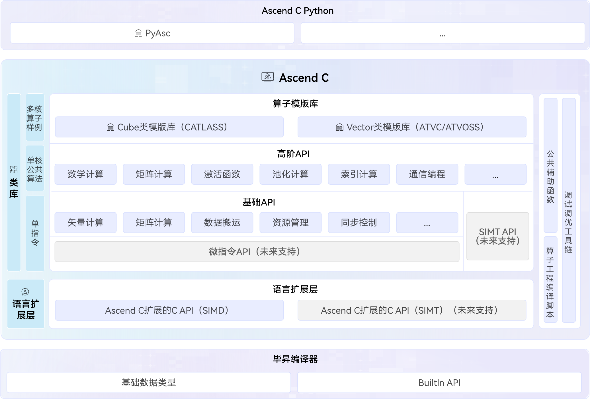

# Ascend C SIG
[Ascend C](https://www.hiascend.com/cann/ascend-c)是面向昇腾AI处理器的专用算子开发语言。它在标准C/C++基础上进行扩展，全面遵循C/C++规范，提供对底层芯片的完整编程能力，助力实现算子极致性能。同时，Ascend C 通过构建多层次编程接口，适应不同场景的算子开发需求，贴近业界开发习惯，显著提升开发效率。

Ascend C总体逻辑架构图如下所示：

# 工作目标
- 规划与设计 Ascend C 多级编程接口（含 Python 前端），覆盖多样化的算子开发场景，兼顾开发效率与运行性能；
- 探讨并规划 Ascend C 在编译能力、调试与调优等方面的技术路线；
- 组织 Ascend C 算子编程领域技术例会，推动技术讨论与决策落地；
- 处理 Ascend C 相关代码仓的缺陷、问题及用户反馈，响应用户诉求。

# Maintainer列表
- 黄金华[@ascendhjh](https://gitcode.com/ascendhjh), *huangjinhua3@huawei.com*
- 诸葛洵[@xun_zhuge](https://gitcode.com/xun_zhuge), *zhugexun@hisilicon.com*

# 仓库清单
- ### AscDevKit: https://gitcode.com/cann/asc-devkit
  - #### 简介：Ascend C算子编程语言核心仓，提供语言扩展层C API和C++类库，支持异构编译和<<<>>>直调，实现芯片完备编程能力，实现极致性能开发
  - #### Committer 列表：
    - 顾欣欣[@ookkkkoo1122](https://gitcode.com/ookkkkoo1122), *guxinxin2@hisilicon.com*
    - 高跃[@gao_dafa](https://gitcode.com/gao_dafa), *gaoyue6@huawei.com*
    - 吴兆麟[@wuzhaolin](https://gitcode.com/wuzhaolin), *wuzhaolin@huawei.com*
    - 田宏民[@horming](https://gitcode.com/horming), *tianhongmin@huawei.com*
    - 李东锋[@mlidongfeng](https://gitcode.com/mlidongfeng), *lidongfeng@huawei.com*
    - 姜泽东[@jiangZD](https://gitcode.com/jiangZD), *jiangzedong2@hisilicon.com*
    - 石楠翔[@shi_nanxiang](https://gitcode.com/shi_nanxiang), *shinanxiang@huawei.com*
    - 王涛[@wqtshg_wt](https://gitcode.com/wqtshg_wt), *wangtao123@huawei.com*
    - 吴洋[@wuyang_hw](https://gitcode.com/wuyang_hw), *wuyang74@hisilicon.com*
    - 杨厚玉[@houyuyang](https://gitcode.com/houyuyang), *yanghouyu@huawei.com*
    - 陈一源[@chenyiyuan](https://gitcode.com/chenyiyuan), *chenyiyuan5@huawei.com*
    - 张浩[@zhanghao_0689](https://gitcode.com/zhanghao_0689), *zhanghao152@huawei.com*
    - 邓静[@dengjing_aoe](https://gitcode.com/dengjing_aoe), *dengjing20@hisilicon.com*
    - 叶珍妮[@YeZZzzz1](https://gitcode.com/YeZZzzz1), *yezhenni1@huawei.com*
    - 黄铎[@DragonBornHD84](https://gitcode.com/DragonBornHD84), *huangduo4@hisilicon.com*
    - 钱鑫海[@bluesky901](https://gitcode.com/bluesky901), *qianxinhai@huawei.com*
    - 朱梁英[@zhuliangying](https://gitcode.com/zhuliangying), *zhuliangying@huawei.com*
    - 吴林玉[@wulinyu](https://gitcode.com/wulinyu), *wulinyu4@huawei.com*
    - 傅珺[@fujun19](https://gitcode.com/fujun19), *fujun19@hisilicon.com*
    - 闫庆尚[@yanqingshang](https://gitcode.com/yanqingshang), *yanqingshang@huawei.com*
    - 艾鑫[@ai_xin](https://gitcode.com/ai_xin), *aixin2@hisilicon.com*

- ### AscTools：https://gitcode.com/cann/asc-tools
  - #### 简介：Ascend C调试调优工具仓，主要包括CPU/NPU孪生调试
  - #### Committer 列表：
    - 诸葛洵[@xun_zhuge](https://gitcode.com/xun_zhuge), *zhugexun@hisilicon.com*
    - 王凯[@kevin365](https://gitcode.com/kevin365), *wangkai86@huawei.com*
    - 杨滨华[@yangbinhua](https://gitcode.com/yangbinhua), *yangbinhua1@huawei.com*
    - 杨学斌[@XuebinYang](https://gitcode.com/XuebinYang), *yangxuebin6@hisilicon.com*
    - 廖晓辉[@sjtulxh](https://gitcode.com/sjtulxh), *liaoxiaohui3@hisilicon.com*
    - 王筱治[@wangxiaozhi](https://gitcode.com/wangxiaozhi), *wangxiaozhi2@huawei.com*

- ### PyAsc：https://gitcode.com/cann/pyasc
  - #### 简介：Ascend C提供Python前端完备编程能力，支撑Python开发者实现极致性能算子
  - #### Committer 列表：
    - 秦名扬[@qin437231](https://gitcode.com/qin437231), *qinmingyang@huawei.com*
    - 苏统华[@sutonghua](https://gitcode.com/sutonghua), *tonghuasu@gmail.com*
    - 武震卿[@wuzhenqing](https://gitcode.com/wuzhenqing), *wuzhenqing@stu.hit.edu.cn*
    - 苏建加[@suqwe](https://gitcode.com/suqwe), *sujianjia@huawei.com*
    - 孔琼卓[@kong0808](https://gitcode.com/kong0808), *kongqiongzhuo@huawei.com*
    - 姜新誉[@jiangxinyu3](https://gitcode.com/jiangxinyu3), *jiangxinyu3@hisilicon.com*
    - 张文涛[@zwtzhang](https://gitcode.com/zwtzhang), *zhangwentao92@huawei.com*

- ### ATVC：https://gitcode.com/cann/atvc
  - #### 简介：Ascend C提供Vector算子模板库，助力用户快速实现Vector类算子开发。
  - #### Committer 列表：
    - 吴林玉[@wulinyu](https://gitcode.com/wulinyu), *wulinyu4@huawei.com*
    - 王筱治[@wangxiaozhi](https://gitcode.com/wangxiaozhi), *wangxiaozhi2@huawei.com*
    - 朱梁英[@zhuliangying](https://gitcode.com/zhuliangying), *zhuliangying@huawei.com*
    - 傅珺[@fujun19](https://gitcode.com/fujun19), *fujun19@hisilicon.com*

# 项目路标
- 2025/11: 基于A2/A3 AscendC 能力全面开源开放；新增PyAsc基于A2/A3提供Python前端完备编程能力；
- 2025/12: 基于A2/A3 AscendC 开放语言扩展层C API，提供业界类似的C API编程体验；
- 2026上半年：
    - 基于A5 全面开放SIMT、SIMD/SIMT新同构编程、基于寄存器的SIMD编程能力；
    - 基于A2/A3/A5 基础API全面支持Tensor Tile API，基于Layout支持Tile编程；
    - PyAsc前端支持基于Layout实现Tensor编程，提供业界类似的Tensor编程体验；
    - 基于Asc仓发布AscendC Lower Level IR(ASC IR，基于MLIR)
- 2026年下半年：
    - 持续完善设备侧类库，完善生态支持；
    - 发布AscendC High Level IR(ASC IR，基于MLIR)

# TOP外部优秀贡献者
  - 苏统华[@sutonghua](https://gitcode.com/sutonghua), *tonghuasu@gmail.com*
  - 武震卿[@wuzhenqing](https://gitcode.com/wuzhenqing), *wuzhenqing@stu.hit.edu.cn*

# 社区运作

### 会议组织

- 公开的会议时间：北京时间，两周一次例会，双周周五上午11:00-12:00
- [议题申报](https://etherpad-cann.meeting.osinfra.cn/p/sig-ascendc)

### 会议纪要

- [会议地址](https://meeting.osinfra.cn/cann/)
- [会议纪要](https://etherpad-cann.meeting.osinfra.cn/p/sig-ascendc)

# SIG订阅

- [邮件订阅](https://mailweb.cann.osinfra.cn/mailman3/lists/ascendc.cann.osinfra.cn/)

# 优秀实践

### asc-tools

- [孪生调试：基于Matmul高阶API快速落地矩阵乘法操作，以轻量Matmul算子为示例，具象化呈现孪生调试能力](https://gitcode.com/cann/asc-tools/tree/master/examples/02_matmul_kernellaunch/)
