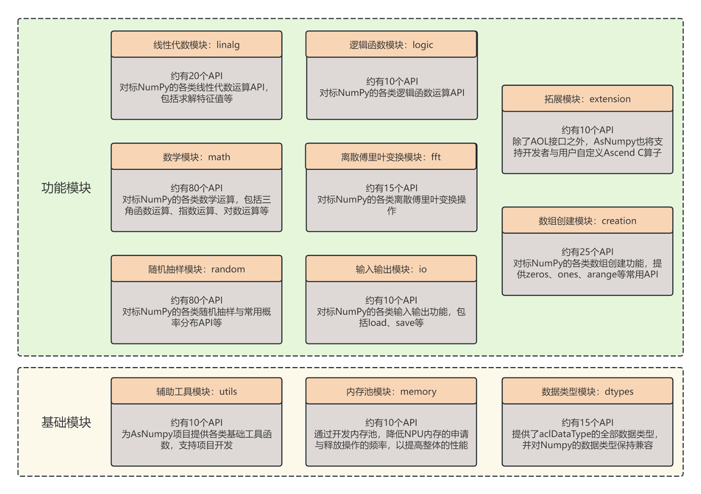

# AsNumpy SIG
AsNumpy是一款 深度支持昇腾NPU并高度兼容numpy接口的轻量级Python数学运算库。它基于pybind11封装华为Ascend C算子库，使用户可以在Python中像使用numpy一样在NPU上进行数学运算。

## 工作目标

- 构建并维护AsNumpy的持续集成/持续部署 (CI/CD) 流程，确保多平台和多版本的兼容性及稳定性
- 实现并支持AsNumpy的高效能计算特性，并提供准确的性能指标
- 负责SIG范围内的代码仓的Bug、Issuse和用户诉求等处理
- 提供项目所需的基础设施服务，保障社区开发和用户使用的顺畅进行

# 成员

### Maintainer列表
- 武震卿[@wuzhenqing](https://gitcode.com/wuzhenqing), *wuzhenqing@stu.hit.edu.cn*
- 赵宇彤[@hyyisasleep](https://gitcode.com/hyyisasleep), *2106975800@qq.com*
- 苏统华[@sutonghua](https://gitcode.com/sutonghua), *tonghuasu@gmail.com*
- 王甜甜[@TiantianWang_Hit](https://gitcode.com/TiantianWang_Hit), *sweetwtt@126.com*

### Committer列表
- 戈昊轩[@gehaoxuan](https://gitcode.com/gehaoxuan), *2310314646@qq.com*
- 支怡超[@zhi_yichao](https://gitcode.com/zhi_yichao), *yichao_zhi@qq.com*
- 周航[@Sea--1024](https://gitcode.com/Sea--1024), *18229820470@139.com*
- 杨季翰[@yang-jihan](https://gitcode.com/yang-jihan), *1553170804@qq.com*
- 贾媛媛[@yuanyuan14](https://gitcode.com/yuanyuan14), *3263715730@qq.com*
- 温咏澎[@meph7sto](https://gitcode.com/meph7sto), *3383540370@qq.com*

# 社区运作

- SIG会议时间：北京时间，每周二晚上19:00-20:00

# 仓库清单

仓库地址：
- https://gitcode.com/cann/asnumpy

