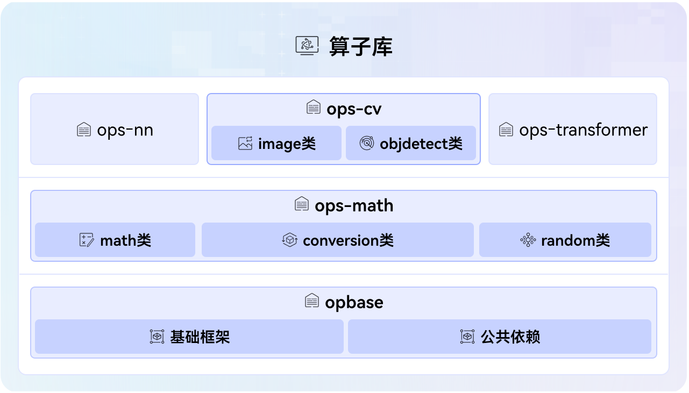

# ops-basic SIG
## 概述
ops-basic SIG是负责维护和开发深度学习框架中核心、基础算子(数学计算、张量变换、随机数、计算机视觉)的兴趣小组。我们致力于提供高性能、高可靠性的基础运算组件，为上层模型和应用构建坚实的计算基石，覆盖了从基础张量变换、基础的数学计算到经典计算机视觉任务的核心计算需求。

## 工作目标
- 负责基础框架和调度能力、数学类、视觉类算子领域技术路线探讨与规划。
- 组织基础框架和调度能力、数学类、视觉类算子领域例会，引导技术讨论和决策。
- 负责SIG范围内的代码仓的Bug、Issuse和用户诉求等处理。

## 职责范围与核心仓库
本SIG主要负责以下三个核心仓库的开发与维护：
*  opbase (基础框架与公共依赖)
   *  定位： 整个算子生态的基石。
   *  功能： 提供aclnn接口运行的基础框架，所有算子仓host侧和kernel侧的公共接口，如日志接口、infershape、tiling和kernel的公共函数。
*  ops-math (数学与张量变换算子)
   *  定位： 提供基础的数学与张量操作能力。
   *  功能： 开发和管理以下类别的算子：
      *  数学运算类 (math)： 如基本的加、减、乘、除、指数、对数、三角函数等算子。
      *  张量变换类 (conversion)： 如形状变换、转置、拼接、分割、广播等算子。
      *  随机数生成类 (random)： 提供符合各种分布的随机数生成算子。
*  ops-cv (计算机视觉算子)
   *  定位： 提供传统与基础深度学习计算机视觉任务的核心操作能力。
   *  功能： 开发和管理以下类别的算子：
      *  图像处理类 (image)： 如插值缩放、空间变换、图像扭曲等算子。
      *  目标检测类 (objdetect)： 计算两个矩阵的重叠面积占两个矩阵总面积的比例、旋转的感兴趣区域对齐等算子。

## 边界与协作
为保持清晰的职责划分，ops-basic SIG与社区其他算子兴趣小组紧密协作，但专注于上述核心领域。 本SIG与[ops-nn SIG](https://gitcode.com/cann/community/blob/f12a0baeb315f1302e92ae8d98e527b43286bf8d/CANN/sigs/ops-nn/README.md)和[ops-transformer SIG](https://gitcode.com/cann/community/tree/f12a0baeb315f1302e92ae8d98e527b43286bf8d/CANN/sigs/ops-transformer)共同提供深度学习网络服务。
本SIG负责opbase、ops-math、ops-cv仓，其在CANN架构中的位置如下图所示：

# 成员

### Maintainer列表
- 周奇龙[@zhou-qilong](https://gitcode.com/zhou-qilong), *zhouqilong2@huawei.com*
- 顾宝成[@gubaocheng](https://gitcode.com/gubaocheng), *gubaocheng@huawei.com*
- 徐鲁威[@loov1](https://gitcode.com/loov1), *xuluwei@huawei.com*

### Committer列表
- 王林木[@llimwang](https://gitcode.com/llimwang), *wanglinmu@huawei.com*
- 骆文[@luowen203_gg123](https://gitcode.com/luowen203_gg123), *luowen16@huawei.com*
- 苏跃明[@su-yueming](https://gitcode.com/su-yueming), *suyueming@huawei.com*
- 陈佳良[@jia0liang](https://gitcode.com/jia0liang), *chenjialiang@huawei.com*
- 王瑞[@wangrui_](https://gitcode.com/wangrui_), *wangrui124@huawei.com*
- 卫朋[@wei-peng-1991](https://gitcode.com/wei-peng-1991), *weipeng19@huawei.com*
- 宋恺[@songkai111](https://gitcode.com/songkai111), *songkai16@huawei.com*
- 陈琦[@chenqi317](https://gitcode.com/chenqi317), *chenqi317@huawei.com*
- 李伟[@LiWei79](https://gitcode.com/LiWei79), *liwei174@huawei.com*
- 於欣洁[@yu-xinjie62](https://gitcode.com/yu-xinjie62), *yuxinjie1@huawei.com*
- 刘鑫鑫[@LiuXinxin23](https://gitcode.com/LiuXinxin23), *liuxinxin23@hisilicon.com*
- 唐燕锋[@FelixTang7](https://gitcode.com/FelixTang7), *tangyanfeng@huawei.com*
- 冯彤[@rxtfeng](https://gitcode.com/rxtfeng), *fengtong5@huawei.com*
- 张浩[@demoauguste](https://gitcode.com/demoauguste), *zhanghao418@huawei.com*
- 张喻翔[@zhangyuxiang0119](https://gitcode.com/zhangyuxiang0119), *zhangyuxiang21@huawei.com*
- 查建青[@zhajianqing123](https://gitcode.com/zhajianqing123), *zhajianqing@huawei.com*
- 史凯[@shikai-1](https://gitcode.com/shikai-1), *shikai4@huawei.com*
- 任如海[@renruhai](https://gitcode.com/renruhai), *renruhai1@huawei.com*
- 刘伟[@liu-wei](https://gitcode.com/liu-wei), *lovline.liuwei@huawei.com*

# 优秀贡献者
*欢迎大家积极贡献成为优秀贡献者*

# 社区运作

### 会议组织

- 公开的会议时间：北京时间，两周一次例会，单周(每月第一、第三周，节假日跳过)周四下午14:15-16:00
- [议题申报](https://etherpad.meeting.osinfra.cn/p/sig-ops-basic)
- [会议地址](https://meeting.osinfra.cn/cann/)

### 会议纪要

- [会议纪要](https://etherpad.meeting.osinfra.cn/p/sig-ops-basic)

# SIG订阅

- [邮件订阅](https://mailweb.cann.osinfra.cn/mailman3/lists/ops-basic.cann.osinfra.cn/)

# 仓库清单

仓库地址：
- https://gitcode.com/cann/opbase
- https://gitcode.com/cann/ops-math
- https://gitcode.com/cann/ops-cv

# 贡献指南
- [贡献指南](CONTRIBUTING.md)

# 优秀实践
- [CANN插值类算子启用矩阵化实现，性能提升10倍，助力多模态模型大幅增效](https://mp.weixin.qq.com/s/Yz9sElLEgtJSUC-kJVoaMg)
- [算子开发入门讲解——IsInf算子开发实践](https://www.hiascend.com/developer/blog/details/0278197035732674115)

# 精彩活动
- [【重磅大奖来袭】25年CANN训练营第二季社区任务开启！完成任务赢取华为三折叠手机、万元笔记本电脑！](https://gitcode.com/org/cann/discussions/22)
