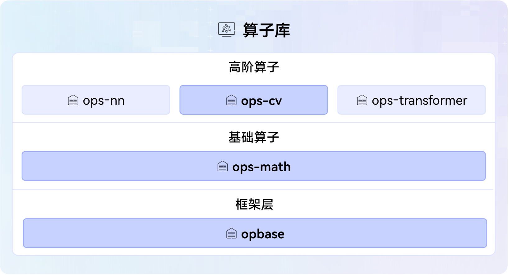

# ops-basic SIG
提供算子基础框架和调度能力，同时包括数学类算子、视觉类算子等。
本SIG负责opbase、ops-math、ops-cv仓，其在CANN架构中的位置如下图所示：

## 工作目标
- 负责基础框架和调度能力、数学类、视觉类算子领域技术路线探讨与规划。
- 组织基础框架和调度能力、数学类、视觉类算子领域例会，引导技术讨论和决策。
- 负责SIG范围内的代码仓的Bug、Issuse和用户诉求等处理。

# 成员

### Maintainer列表
- 周奇龙[@zhou-qilong](https://gitcode.com/zhou-qilong), *zqlong_sunday@126.com*
- 顾宝成[@gubaocheng](https://gitcode.com/gubaocheng), *baocheng_gu@outlook.com*
- 徐鲁威[@loov1](https://gitcode.com/loov1), *loovix@foxmail.com*

### Committer列表
- 王林木[@llimwang](https://gitcode.com/llimwang), *wanglinmu@huawei.com*
- 骆文[@luowen203_gg123](https://gitcode.com/luowen203_gg123), *luowen203@qq.com*
- 苏跃明[@su-yueming](https://gitcode.com/su-yueming), *sym660@126.com*
- 陈佳良[@jia0liang](https://gitcode.com/jia0liang), *541127580@qq.com*
- 王瑞[@wangrui_](https://gitcode.com/wangrui_), *wangrui124@huawei.com*
- 卫朋[@wei-peng-1991](https://gitcode.com/wei-peng-1991), *weipeng19@huawei.com*
- 宋恺[@songkai111](https://gitcode.com/songkai111), *songkai16@huawei.com*
- 陈琦[@chenqi317](https://gitcode.com/chenqi317), *chenqi317@huawei.com*
- 李伟[@LiWei79](https://gitcode.com/LiWei79), *liwei174@huawei.com*
- 於欣洁[@yu-xinjie62](https://gitcode.com/yu-xinjie62), *porcelina@163.com*
- 刘鑫鑫[@LiuXinxin23](https://gitcode.com/LiuXinxin23), *liuxinxin23@hisilicon.com*
- 唐燕锋[@FelixTang7](https://gitcode.com/FelixTang7), *tangyanfeng@huawei.com*
- 冯彤[@rxtfeng](https://gitcode.com/rxtfeng), *fengtong5@huawei.com*
- 张浩[@demoauguste](https://gitcode.com/demoauguste), *393493772@qq.com*
- 张喻翔[@zhangyuxiang0119](https://gitcode.com/zhangyuxiang0119), *2541674162@qq.com*
- 查建青[@zhajianqing123](https://gitcode.com/zhajianqing123), *729079106@qq.com*
- 史凯[@shikai-1](https://gitcode.com/shikai-1), *shikai4@huawei.com*
- 任如海[@renruhai](https://gitcode.com/renruhai), *renruhai1@huawei.com*
- 刘伟[@liu-wei](https://gitcode.com/liu-wei), *lovline.liuwei@huawei.com*

# 社区运作

### 会议组织

- 公开的会议时间：北京时间，两周一次例会，单周周五下午14:00-16:00
- [议题申报](https://etherpad.meeting.osinfra.cn/p/sig-ops-basic)

### 会议纪要

- [会议地址](https://meeting.osinfra.cn/cann/)
- [会议纪要](https://etherpad.meeting.osinfra.cn/p/sig-ops-basic)

# SIG订阅

- [邮件订阅](https://mailweb.cann.osinfra.cn/mailman3/lists/ops-basic.cann.osinfra.cn/)

# 仓库清单

仓库地址：
- https://gitcode.com/cann/opbase
- https://gitcode.com/cann/ops-math
- https://gitcode.com/cann/ops-cv
