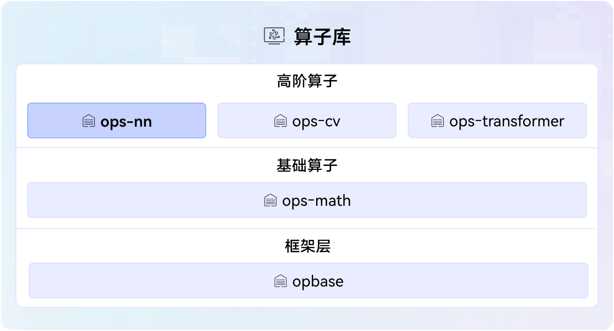

# ops-nn SIG
提供神经网络计算能力的高阶算子库，简称ops-nn，涵盖常见的张量matmul、activation、loss计算等操作。 ops-nn在CANN架构中位置如下图所示：

# 成员

### Maintainer列表
- 唐玮玮[@tangweiwei2](https://gitcode.com/tangweiwei2), *tangweiwei2@huawei.com*
- 陈琦[@chenqi317](https://gitcode.com/chenqi317), *chenqi317@huawei.com*
- 刘波[@liubo75](https://gitcode.com/liubo75), *liubo75@huawei.com*
- 胡碧霞[@crystalhu](https://gitcode.com/crystalhu), *hubixia1@huawei.com*

### Committer列表
- 周奇龙[@zhou-qilong](https://gitcode.com/zhou-qilong), *zhouqilong2@huawei.com*
- 范其瑞[@fanqirui](https://gitcode.com/fanqirui), *fanqirui1@huawei.com*
- 郑李磊[@lileizheng](https://gitcode.com/lileizheng), *zhenglilei@huawei.com*
- 刘伟[@liu-wei](https://gitcode.com/liu-wei), *lovline.liuwei@huawei.com*
- 王永光[@wangyongguang](https://gitcode.com/wangyongguan), *wangyongguang1@huawei.com*
- 於欣洁[@yu-xinjie62](https://gitcode.com/yu-xinjie62), *yuxinjie1@huawei.com*
- 唐超[@chaotang233](https://gitcode.com/chaotang233), *tangchao47@huawei.com*
- 查建青[@zhajianqing123](https://gitcode.com/zhajianqing123), *zhajianqing@huawei.com*
- 唐燕峰[@FelixTang7](https://gitcode.com/FelixTang7), *tangyanfeng@huawei.com*
- 张瑜翔[@zhangyuxiang0119](https://gitcode.com/zhangyuxiang0119), *zhangyuxiang21@huawei.com*
- 章武[@zhang-wu](https://gitcode.com/zhang-wu), *zhangwu3@huawei.com*

# 社区运作

### 会议组织

- 公开的会议时间：北京时间，两周一次例会，单周周五下午14:00-16:00

### 会议纪要

- [会议地址](https://meeting.osinfra.cn/cann/)
- [会议纪要](https://etherpad.meeting.osinfra.cn/p/sig-ops-nn)

# SIG订阅

- [邮件订阅](https://mailweb.cann.osinfra.cn/mailman3/lists/ops-nn.cann.osinfra.cn/)

# 仓库清单

仓库地址：
- https://gitcode.com/cann/ops-nn