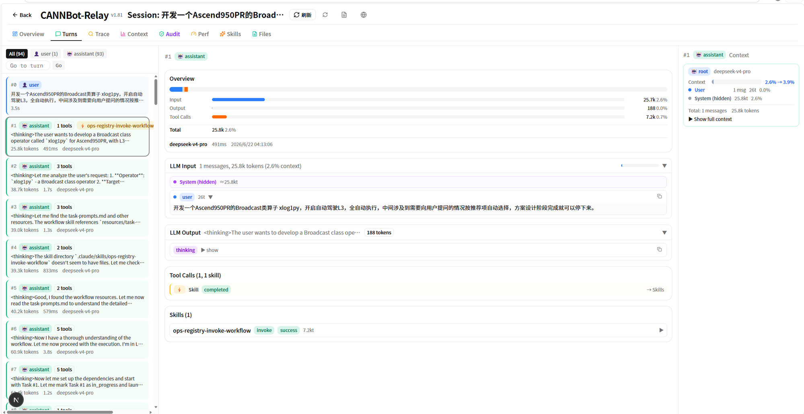

# CANNBot-Relay 仓开源测试报告

| 项目 | 内容 |
|---|---|
| 报告日期 | 2026-08-31 |
| 测试对象 | [`cann/cannbot-relay`](https://gitcode.com/cann/cannbot-relay)（即 cannbot-insight，开源仓新名） |
| 被测版本 | `cf103bc93b151ce59af77f173c3c31b22e5deaec`（v2.02） |
| 测试范围 | 会话导入与观测数据链路；轨迹评分 v2 六维体系；代理捕获与数据治理；三端（Web/TUI/CLI）一致性；导出与上传 |
| 测试方式 | vitest 全量自动化测试（单元 + 数据驱动集成 + 端到端 IT + 渲染冒烟）+ 生产构建验证 |
| 总体结论 | 全部测试**通过**：143 个测试文件 / 1486 个用例，0 失败、0 跳过；`next build` 通过 |

## 1. 全量自动化测试总览

### 1.1 测试命令与环境

```bash
npm run test      # vitest run，全量
npm run build     # next build（Turbopack），生产构建验证
```

环境：Linux 6.6.87（WSL2）· Node 22 · vitest 3.2.6（渲染用例使用 happy-dom）。

### 1.2 总体结果

| 指标 | 数值 |
|---|---:|
| 测试文件 | 143 |
| 测试套件（describe） | 523 |
| 用例总数 | 1486 |
| 通过 | **1486（100%）** |
| 失败 | **0** |
| 跳过 | **0** |
| 总耗时 | 约 24s（用例并行执行 45s） |
| 生产构建 | ✓ 编译通过，55/55 静态页生成 |

### 1.3 分组统计

| 分组 | 文件数 | 用例数 | 覆盖内容 |
|---|---:|---:|---|
| `tests/`（根） | 81 | 1026 | 导入管线、评分 v2、审计、CANNBay 上传/导出、API 路由、渲染冒烟 |
| `tests/cli/` | 43 | 278 | CLI 命令、TUI（Ink）组件、客户端封装 |
| `proxy/tests/` | 10 | 102 | cpx 代理捕获、脱敏、压缩、独立安装 |
| `tests/adapters/` | 5 | 50 | opencode-db / claude-jsonl 双数据源适配器 |
| `tests/compare-perf/` | 4 | 31 | 会话对比算法（banded DP）正确性与规模性能 |

## 2. 会话导入与观测数据链路测试

### 2.1 测试目标

验证多数据源会话（opencode 原生 DB、claude-jsonl 捕获文件）经适配器 → 归一化 → 轮次切分 → 执行拆分 → 入库的完整链路，以及 22 个 `/api/observe/*` 端点的查询正确性。

### 2.2 覆盖方式与用例数

| 管线环节 | 测试文件 | 用例数 |
|---|---|---:|
| 双源适配器 | tests/adapters/（5 文件） | 50 |
| 轮次切分 turn-split | tests/turn-split.test.ts | 49 |
| 桥接构建 bridge-builder | tests/bridge-builder.test.ts | 31 |
| 归一化 normalize | tests/normalize.test.ts | 14 |
| 执行拆分 execution-split | tests/execution-split.test.ts | 19 |
| 会话合并 | merge / merge-dedup-drift / merge-execution-rebuild | 30 |
| 轮次对齐 | turn-align 系列（4 文件，含压力与手工对拍） | 47 |
| 输入重建 | input-reconstruct.test.ts | 14 |
| 入库服务 | data-service.test.ts | 7 |
| 端到端（导入 → 观测 API） | e2e-import-observe.test.ts | 20 |

全部用例为 **fixture 数据驱动**（`tests/data/` 下的 JSONL/DB 样本走真实管线），不做脱离数据的函数级 mock。

### 2.3 数据完整性（round-trip）

DB → 导出 → 再导入的列清单对账集成测试证明**零字段丢失**；捕获 jsonl 的 wire 轮次重建与 `/api/observe/session/wire-rounds` 路由同构（append-only 口径），对应用例覆盖在 cannbay-schema / cannbay2 系列（合计 122 用例，含 100MB 超限熔断）。

### 2.4 结论

导入与观测链路的各环节均有独立测试锁定，端到端用例验证从原始数据到 API 输出的完整数据流，本部分结论为**通过**。

## 3. 轨迹评分体系 v2（六维）测试

### 3.1 测试目标

验证六维评价体系（D1 完成度 / D2 行为可信两道否决关 + D3 质量 / D4 效率 / D5 冗余度 / D6 自主性四维加权 + D7 用户自定义）的评分正确性、聚合规则与工程约束（零 Prisma 改动、LLM 成本记账、错误态不静默）。

### 3.2 覆盖点（72 用例）

| 文件 | 用例 | 层 | 覆盖点 |
|---|---:|---|---|
| scoring-v2-core.test.ts | 30 | 单元 | 聚合引擎五种策略；整卡否决 + 覆盖度 + 权重归一；**新增维度零改引擎回归**；自研 shell 拆分；测试输出解析；LLM 输出三层约束；评分卡文件存储（重算归档 / 否决卡不进基线 / 路径穿越拒绝）；基线位置分；**buildChatUrl/stripJsonFence 双侧 parity 用例** |
| scoring-v2-dims.test.ts | 26 | 维度验收 | D1 组合表逐行锁；D2 规则层（破坏性操作确凿/疑似分级、密钥只判落盘外传、凭据读后外传才确凿）；D3/D5/D6 直算层手算值；LLM 纪律（未配置不适用 / 解析失败错误态 / 算子三项按任务类型不适用） |
| scoring-v2-it.test.ts | 14 | 端到端 | fixture JSONL → 真实导入 → runScorecard：六维结构、否决（总分 null + 原因）、截断 session 整卡中止不落盘、LLM stub 合并 + 成本记账、错误态注入流程不断、评分 API（现算/缓存/重算/404）、**semantic NDJSON 流式进度**（15 个 LLM 子项 30 条进度事件、不适用子项调用前跳过不花钱） |
| scoring-v2-render.test.tsx | 2 | 渲染 | 六维 + D7 通用维度卡渲染、否决标注、§N 证据链接、六维能力雷达图（纯 SVG）、loading↔ok 收敛不循环 |

### 3.3 关键设计约束的验证

| 约束 | 验证方式 |
|---|---|
| 零 Prisma schema 改动 | 评分卡落 `data/scorecards/` 文件存储，集成测试断言写盘/归档/基线语料过滤 |
| LLM 层不花钱的跳过 | 不适用子项（无验收清单/红线/高危操作等）在调用前短路，实测 15 项 LLM 子项仅 8 次真实调用 |
| 失败也是记录 | 单子项注入异常 → error 态入卡、流程不断（IT 覆盖） |
| 截断不评分 | stop_reason=max_tokens → 整卡 aborted、不写盘、不进基线语料 |

### 3.4 结论

六维体系的判定规则、聚合策略、工程约束均有手算值级别的用例锁定，本部分结论为**通过**。

## 4. 代理捕获与数据治理测试

### 4.1 覆盖点

`proxy/tests/` 10 文件 / 102 用例：

- cpx 代理捕获（claude / opencode / cannbot UA 分流、行级 `x_cannbay` 扩展字段）；
- 脱敏器（URL 参数 / 鉴权字段 / 正文，厂商密钥格式命中）；
- 行流 gzip 压缩落盘与透明解压；
- 独立安装脚本（`proxy/install.sh`，insight 未安装时捕获仍可用）。

框架分流回归锁（`cannbot-proxy-framework` / `opencode-proxy-framework` / `proxy-framework-repair`）保证 UA 口径变化时原生路径逐字节不变。

### 4.2 结论

捕获、脱敏、压缩、安装四类代理能力均有独立测试，上传数据治理（密钥清洗 + 残留熔断）在 cannbay2 系列用例中验证，本部分结论为**通过**。

## 5. 三端一致性与呈现测试

三端（Web / TUI / CLI）为同一后端 22 个 `/api/observe/*` 端点的纯客户端，测试按两层覆盖：

| 层 | 用例 | 说明 |
|---|---:|---|
| API 层 | observe-api / turns-search / skill-content 等路由测试 | 端点行为、错误码、分页 |
| 渲染冒烟 | happy-dom 静态渲染（9 文件 48 用例） | 关键组件（评分卡、技能审计、trace 高亮、LLM 注入视图）渲染正确、无死循环 |

CLI/TUI 侧 43 文件 278 用例覆盖命令行参数、Ink 组件（自实现，无第三方组件）、CJK 宽度处理。

### 结论

本部分结论为**通过**。

## 6. 静态检查与已知问题

| 项 | 结果 |
|---|---|
| TypeScript（被测代码） | 零错误 |
| ESLint（新增/改动文件） | 零告警 |
| ESLint（仓库存量） | 存在 1371 个历史遗留问题，分布在与本版本无关的早期文件，不阻塞发布，后续专项清理 |
| 生产构建 | `next build` 通过（Turbopack） |

## 7. 功能验证（Web 端实机）

自动化测试之外，对 Web 端做实机功能验证。下图为真实会话（Ascend950PR Broadcast 类算子开发，94 轮）的详情页：



验证要点：

| 验证项 | 图中对应 | 结果 |
|---|---|---|
| 轮次列表与过滤 | 左侧 All(94) / user(1) / assistant(93) 过滤器，逐轮角色徽标、工具调用数、token、耗时、模型名 | ✓ |
| 逐轮 token 构成 | Overview 分段进度条：Input 25.7k（2.6%）/ Output 188 / Tool Calls 7.2k | ✓ |
| LLM 输入重建 | LLM Input 面板可见 System（hidden，≈25.8kt）与 user 消息的逐轮构成 | ✓ |
| 上下文窗口占用 | 右侧 Context 面板：2.6% → 3.9%，user/system/total 分类占比 | ✓ |
| 思考与工具调用 | LLM Output 的 thinking 面板；Tool Calls / Skills 面板（`ops-registry-invoke-workflow`，7.2kt，invoke + success） | ✓ |
| 多 Tab 导航 | Overview / Turns / Trace / Context / Audit / Perf / Skills / Files | ✓ |

实机表现与自动化测试结论一致，本部分结论为**通过**。

## 8. 总体结论

- 全量自动化测试 **1486/1486 通过、零失败、零跳过**；
- 生产构建通过，被测代码类型与静态检查干净；
- 数据链路、评分体系、代理治理、三端呈现四个方面均有数据驱动的集成级用例锁定。

**CANNBot-Relay 当前版本满足开源发布质量要求，测试总体结论为：通过。**

## 9. 数据来源

- 测试执行记录：`npm run test`（vitest JSON reporter 聚合），执行时间 2026-08-31；
- 测试报告产物：`npm run test:report`（JUnit XML）/ `npm run test:report:html`（HTML）；
- 被测版本：`cf103bc93b151ce59af77f173c3c31b22e5deaec`（分支 `feat/score`，v2.02）；
- 明细版报告：随 cannbot-relay 仓发布（`docs/test-report-v2.01.md`）。
