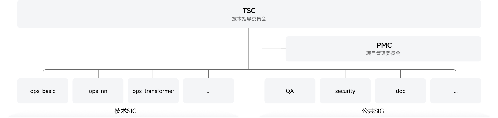

# CANN 社区

欢迎来到 CANN 社区！

## community 简介

本 community 仓库主要承载 CANN 社区的相关信息，包括社区治理架构、治理章程、用户行为准则、CLA 签署流程以及参与贡献指南等内容。

## 社区治理架构

CANN 社区采用分层协作的治理模式，当前架构主要包括以下组织：

- [技术指导委员会（TSC）](CANN/TSC/README.md) —— 负责技术愿景与方向决策
- [项目管理委员会（PMC）](CANN/PMC/README.md) —— 统筹项目规划与执行管理
- [特别兴趣小组（SIG）](CANN/sigs/) —— 专注特定技术领域或公共能力建设

## 社区治理章程

如需了解社区治理章程，请参阅以下文档：

- [技术指导委员会（TSC）治理章程](governance/tsc-governance.md)
- [项目管理委员会（PMC）治理章程](governance/pmc-governance.md)
- [特别兴趣小组（SIG）治理章程](governance/sig-governance.md)
- [社区角色定义及晋升机制](governance/role-definition-and-promotion-mechanism.md)

## 用户行为准则

参与社区贡献前，请仔细阅读并遵守社区[用户行为准则](contributor/code-of-conduct.md)。您在 CANN 社区的所有活动（包括但不限于发表评论、提交 Issue/PR/文档等）均需遵循此准则。

## 签署 CLA

参与项目贡献前，请根据您的贡献者身份签署相应的贡献者许可协议（CLA）。具体操作步骤请参阅：[CLA 使用指南](https://gitcode.com/cann/infrastructure/blob/main/docs/cla/cla使用指南.md)。

## 参与贡献

完成 CLA 签署并确定贡献方向后，即可开始您的社区贡献之旅！社区欢迎各种形式（Issue、PR、会议、邮件、软件包等）的贡献，每一种贡献都将受到重视。

### 基础贡献

#### 参与社区会议

如需参加社区 TSC/PMC/SIGs 等组织会议，请访问[社区会议看板](https://meeting.osinfra.cn/cann)获取详细信息。社区提供[会议材料模板](templates/ppt_template.pptx)，您可在对应会议白板上申报议题。具体操作步骤请参阅：[社区会议指南](https://gitcode.com/cann/infrastructure/blob/main/docs/meeting/CANN社区会议指南.md#二如何参与会议)。

#### 参与社区邮件讨论

关注社区 TSC/PMC/SIGs 等组织动态的用户，可通过订阅[社区邮件列表](https://mailweb.cann.osinfra.cn/postorius/lists/)获取最新消息和历史信息归档（包括会议通知、会议纪要等），并且通过邮件参与讨论、发起讨论、求助、申报会议议题等。具体操作步骤请参阅：[邮件列表使用指南](https://gitcode.com/cann/infrastructure/blob/main/docs/mail-list/邮件列表使用指南.md)。

#### 提交Issue/处理Issue任务

CANN 社区基于 GitCode 的 Issue 管理功能，完整记录每个开发者 Issue 的处理流程。您可以对 Issue 进行查找、创建、评论、处理等操作。具体操作步骤请参阅：[Issue 操作指南](contributor/issue-operation.md)。

#### 提交 PR

参与 CANN 社区代码贡献时，提交 PR 前需完成开发环境准备，并仔细了解项目特定的开发规范和版权声明要求，确保您的贡献符合项目标准。具体操作步骤请参阅：[PR 操作指南](contributor/pull_request_operation.md)。

### 进阶贡献

#### 新建 SIG / 成为核心贡献者

如希望深度参与社区贡献和决策，可申请创建 SIG 或成为 TSC/PMC/SIGs 的关键成员。成为核心贡献者后，您将能够主导或参与更多社区贡献及决策。具体操作步骤请参阅：[社区组织管理指南](contributor/organization.md)。

#### 组织会议

成为社区贡献者后，您将获得组织会议的权限，可进行会议创建、修改、删除等操作。具体操作步骤请参阅：[社区会议指南](https://gitcode.com/cann/infrastructure/blob/main/docs/meeting/CANN社区会议指南.md#三如何组织会议)。

#### 新建仓库及 CI 配置

如希望独立新建仓库向社区贡献，可向 TSC 会议申报建仓议题（使用[新建仓申报模板](templates/新建仓申报模板%20v0.1.pptx)）。评审通过后，向基础设施 SIG [提交 Issue](https://gitcode.com/cann/infrastructure) 申请执行仓库创建。

仓库创建完成后，请准备 CI 流水线（门禁及版本）适配所需内容（编译及 DT 执行脚本等），并提交 Issue 说明 CI 适配需求，基础设施 SIG 将安排专人负责流水线适配对接工作。具体操作步骤请参阅：[门禁与版本集成流程指南](contributor/repository/ci-guide.md)。

#### 引入开源三方件

贡献过程中如需引入开源软件，需完成开源软件选型评估并提交引入申请，通过安全 SIG 评审后引入社区开源三方件仓库，以便相关仓库更好地集成和引用。具体操作步骤请参阅：[开源三方件维护指南](contributor/third_party/third_party_maintenance.md)。

#### 新版本发布 / 新仓库开源发布

新版本/新仓库开源发布前，需准备相关[测试报告](contributor/testing/test-templates/测试报告模板.md)并提交 QA-SIG 会议评审，确认是否符合质量出口标准。评审通过后，向 PMC 会议提交发布评审申请。通过后，PMC 将提供相关资源渠道用于后续发布宣传。
