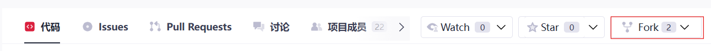
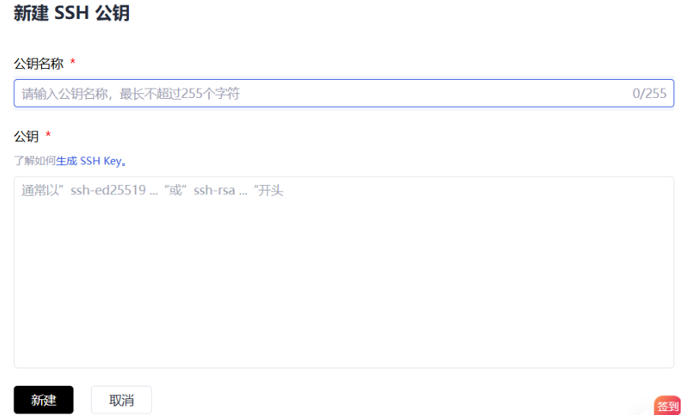
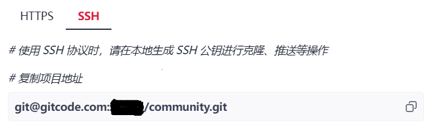

# GitCode 工作流说明

## 1. 准备工作

在开始 GitCode 工作流之前，请确保完成以下准备：

- **安装 Git**：确保您的计算机已安装 Git。如需学习 Git 使用方法，可通过 Google、百度等搜索引擎查询相关教程。
- **寻找项目**：在 CANN 代码托管平台上找到您感兴趣的项目。如尚未找到，请参考 [CANN 组织介绍](https://gitcode.com/cann)。

## 2. 准备本地代码

### 2.1 Fork 个人分支

1. 打开目标项目首页
2. 点击右上角的 `Fork` 按钮，按照指引创建属于**个人**的云端 Fork 分支



### 2.2 克隆 Fork 分支到本地

#### 2.2.1 创建本地工作目录

```bash
mkdir ${your_working_dir}
```

#### 2.2.2 配置 Git 用户信息

> **注意**：如已配置过，可跳过此步骤

设置 GitCode 个人用户名：
```bash
git config --global user.name "your_GitCode_Name"
```

配置 Git 邮箱：
> **注意**：建议与CLA签署邮箱保持一致

```bash
git config --global user.email "email@your_GitCode_email"
```

#### 2.2.3 注册 SSH 公钥

> **说明**：完成此注册可避免每次操作都需要输入账户密码

1. **生成 SSH 公钥**：
   ```bash
   ssh-keygen -t rsa -C "email@your_GitCode_email"
   cat ~/.ssh/id_rsa.pub
   ```

2. **在 GitCode 网站添加公钥**：
   - 登录 GitCode，点击右上角个人头像进入"个人设置"
   - 在"安全设置" → "SSH 公钥"中点击"+SSH 公钥"
   - 添加刚才生成的公钥内容

   

3. **验证 SSH 连接**：
   ```bash
   ssh -T git@gitcode.com
   ```
   看到 `remote: Welcome to GitCode, $user_name` 提示表示配置成功。

#### 2.2.4 克隆远程仓库到本地

1. **切换至工作目录**：
   ```bash
   cd ${your_working_dir}
   ```

2. **克隆仓库**：
   - 在远程仓库首页点击"Clone"获取 `$remote_link`
   
   
   
   - 执行克隆命令：
   ```bash
   # 克隆远程仓库到本地
   git clone git@gitcode.com:${user_name}/${repository_name}.git
   
   # 设置上游仓库（被 Fork 的原始仓库）
   git remote add upstream git@gitcode.com:cann/${repository_name}.git
   ```

### 2.3 创建本地分支

更新并同步本地分支：
```bash
git fetch upstream
git checkout master
git rebase upstream/master
```

创建个人开发分支：
```bash
git checkout -b myfeature
```
其中 `myfeature` 为个人分支名称，后续在此分支上进行代码编辑和修改。

## 3. 本地构建和验证

具体构建和验证方法请参考对应开源项目仓库中的相关文档。

## 4. 保持分支与 Master 同步

```bash
# 在 myfeature 分支上执行
git fetch upstream
git rebase upstream/master
```

> **重要建议**：
> - 不建议使用 `git pull` 代替 `fetch` / `rebase`，因为 `git pull` 会产生合并提交，使提交历史变得混乱
> - 可通过配置改变默认行为：`git config branch.autoSetupRebase always`

## 5. 提交本地变更

提交代码变更：
```bash
git add .
git commit -m "提交说明"
```

如需在前次提交基础上继续修改，可使用：
```bash
git commit --amend
```

## 6. 推送变更到远程仓库

准备代码审查时，将分支推送到 GitCode 上的 Fork 分支：
```bash
git push -f origin myfeature
```

## 7. 创建 Pull Request

1. 访问 `https://gitcode.com/${user}/${repository_name}` 页面

2. 进入"Pull Requests"标签页，点击右上角`+新建 Pull Request`

3. 在创建界面确认源分支和目标分支，创建 PR

> **注意**：PR 是对项目分支的一次合入操作，请谨慎操作以确保代码质量。

## 8. 查看门禁状态和代码审查意见

### 8.1 查看门禁状态
PR 提交后，请在评论中输入 "/compile" 触发门禁检查。检查时间因仓库而异，请关注检查状态并及时修复问题。

### 8.2 查看代码审查意见
门禁检查通过后，PR 会被分配给一个或多个审查者进行代码审查。您可以在 PR 页面查看所有评论和评审意见。

## 9. 附录：常用操作

### 9.1 回退提交

如需回退某个提交，请按以下步骤操作：

1. **创建回退分支并同步**：
   ```bash
   git checkout -b myrevert
   git fetch upstream
   git rebase upstream/master
   ```

2. **执行回退操作**：
   - **回退合并提交**：
     ```bash
     # SHA 为要回退的合并提交哈希值
     git revert -m 1 SHA
     ```
   - **回退单个提交**：
     ```bash
     # SHA 为要回退的单个提交哈希值
     git revert SHA
     ```

3. **推送到远程回退分支**：
   ```bash
   git push ${your_remote_name} myrevert
   ```

### 9.2 处理提交冲突

如果 PR 显示冲突标记，说明存在代码冲突需要解决：


1. **切换到 master 分支并同步**：
   ```bash
   git checkout master
   git fetch upstream
   git rebase upstream/master
   ```

2. **切换回个人分支并变基**：
   ```bash
   git checkout yourbranch
   git rebase master
   ```

3. **解决冲突**：使用编辑器查看并解决所有冲突文件

4. **完成变基并推送**：
   ```bash
   git add .
   git rebase --continue
   git push -f origin yourbranch
   ```

### 9.3 合并提交

如果多次提交后希望整理提交历史，可以使用压缩提交：

1. **查看提交日志**：
   ```bash
   git log
   ```

2. **交互式变基**：
   ```bash
   git rebase -i HEAD~n  # n 为要合并的提交数量
   ```
   在编辑界面中将需要压缩的提交前的 `pick` 改为 `squash` 或 `s`（保留至少一个 `pick`）

3. **编辑提交信息**：
   - 按 `ESC` 键后输入 `:wq` 保存
   - 根据需要编辑合并后的提交信息
   - 再次按 `ESC` 后输入 `:wq` 完成

4. **强制推送**：
   ```bash
   git push -f origin yourbranch
   ```

完成后再 GitCode PR 页面即可看到提交已合并。