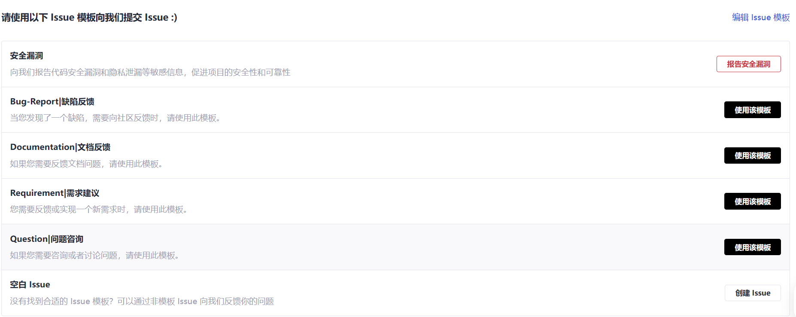

#  Issue 操作指南

## 1.1 查找 Issue

### 1.1 全局搜索

在 CANN 社区首页选择 **[Issues](https://gitcode.com/org/cann/issues)** 板块，在搜索框中输入关键字，即可对社区内所有项目的 Issue 标题及内容进行全局搜索。

### 1.2 项目内搜索

在 CANN 社区首页选择 **[项目](https://gitcode.com/org/cann/repos)** 板块，进入具体项目主页，点击 **Issues** 板块，在搜索框中输入关键字，即可对本项目的所有 Issue 进行搜索。

## 1.2 创建 Issue

如果您需要上报 Bug、提交需求，或为社区提供建议，请按以下步骤操作：

1）在 CANN 社区首页选择 **[项目](https://gitcode.com/org/cann/repos)** 板块。

2）选择具体项目（若不明确归属，可提交至 **[community](https://gitcode.com/cann/community)** 仓库，由社区协助分发）。

3）进入项目主页，创建 Issue。

### 1.2.1 新建 Issue

在项目 Issue 板块中，单击 **新建 Issue**，即可进入Issue类型选择界面。
   
1）单击 **新建 Issue**。
     
   
2）根据需求选择 Issue 类型（如 Bug-Report、Documentation、Requirement、Question、安全漏洞等），单击 **使用该模板** 或 **报告安全漏洞** 或 **创建 Issue** 进入Issue详细页面。
     
  
### 1.2.2 填写 Issue

在 Issue 填写界面中按提示填写相关信息：
   

- **标题**：简要描述需求或问题要点。
- **内容**：根据系统提供的模板提示详细填写具体内容，以便我们更好地理解和处理。

### 1.2.3 提交 Issue

填写完成后，单击 **提交 Issue** 或 **新建 Issue** 完成创建。

> 若 Issue 用于自我跟踪或跟踪他人，建议提交后将责任人指派给自己或具体责任人（操作参考“处理 Issue”章节），以降低仓库对应 SIG maintainer 的处理成本。否则，无需填写负责人等信息，SIG maintainer 会定期审视并分配 Issue。

## 1.3 评论 Issue

每个 Issue 下方均支持开发者交流讨论，欢迎在评论区发表意见。

## 1.4 处理 Issue

- 在评论框中输入 `/assign` （分配给自己）或 `/assign @gitcode_id`（分配给特定账号），机器人会按assign  要求进行分配。
- 对应gitcode_id 将显示在 Issue 负责人列表中。

> 前置条件：Issue 负责人必须是 Issue 提交者或项目成员。若希望成为项目成员，请联系[对应仓库 SIG](../CANN/sigs) maintainer 添加。
