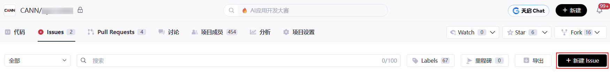
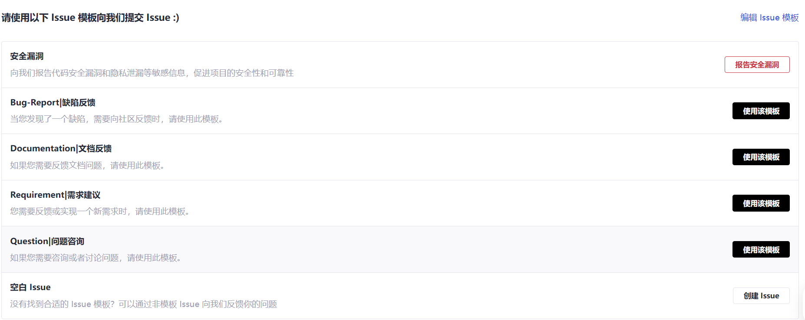
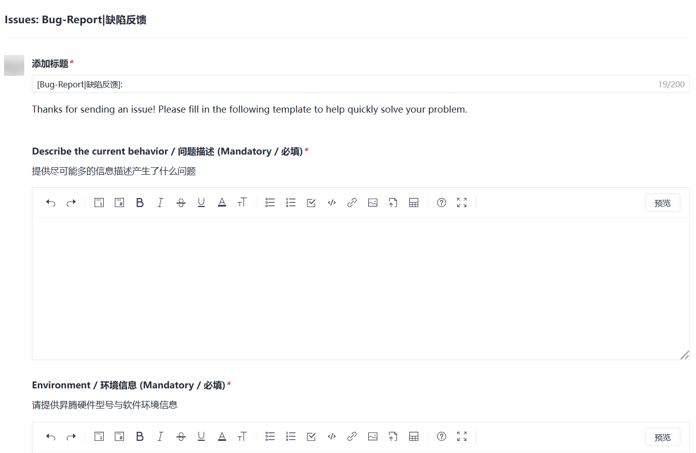

#  Issue 操作指南

## 1. 🔍 查找 Issue

### 1.1 🌐 全局搜索

**适用场景**：需要跨所有项目搜索相关 Issue。

**操作步骤**：
1. 访问 [CANN 社区 Issues 板块](https://gitcode.com/org/cann/issues)
2. 在搜索框中输入关键字（支持标题及内容搜索）
3. 按 Enter 键或点击搜索按钮进行搜索

### 1.2 📁 项目内搜索

**适用场景**：只在特定项目内搜索 Issue。

**操作步骤**：
1. 访问 [CANN 社区项目列表](https://gitcode.com/org/cann/repos)
2. 选择目标项目，进入项目主页
3. 点击 **Issues** 标签页
4. 在搜索框中输入关键字进行搜索

## 2. ✨ 创建 Issue

如果您需要上报 Bug、提交需求或提供建议，请按以下流程操作：

### 2.1 🎯 选择项目

1. 访问 [CANN 社区项目列表](https://gitcode.com/org/cann/repos)
2. 选择与问题相关的目标项目
   > **💡不确定归属时**：可提交至 **[community](https://gitcode.com/cann/community)** 仓库，社区将协助分发至合适的 SIG 或仓库。

### 2.2 ➕ 新建 Issue

1. 进入目标项目主页的 **Issues** 标签页
2. 点击 **新建 Issue** 按钮
   

### 2.3 📝 选择 Issue 类型

系统将显示 Issue 类型选择界面：
   

根据您的需求选择相应类型：
- **Bug-Report**：报告软件缺陷
- **Documentation**：文档相关改进
- **Requirement**：新功能需求
- **Question**：使用问题咨询
- **安全漏洞**：安全相关问题（需谨慎处理）

选择后点击 **使用该模板**、**报告安全漏洞** 或 **创建 Issue**。

### 2.4 📋 填写 Issue 详情

进入 Issue 详细填写页面：
   

**填写要求**：

| 字段 | 说明 | 填写建议 |
|------|------|----------|
| **标题** | Issue 的简要描述 | 清晰概括问题核心，便于搜索和识别 |
| **内容** | 详细的问题描述 | 按照模板提示完整填写，包括： • 问题现象 • 复现步骤 • 期望结果 • 实际结果 • 环境信息（如适用） |

### 2.5 🚀 提交 Issue

填写完成后，点击 **提交 Issue** 或 **新建 Issue** 完成创建。

> **📌 最佳实践**：
> - 若 Issue 用于自我跟踪，建议提交后立即指派给自己（参考[第4章：处理 Issue](#4-处理-issue)）
> - 若跟踪他人工作，指派给具体负责人
> - 无需主动指派时，SIG maintainer 会定期审视并分配 Issue

## 3. 💬 评论 Issue

每个 Issue 下方都设有评论区，支持：
- 📝 补充问题细节
- 💡 提供解决方案建议
- 🤝 讨论技术实现
- ✅ 确认问题状态

> **注意**：请保持评论内容与Issue相关，遵守[社区行为准则](code-of-conduct.md)。

## 4. ⚙️ 处理 Issue

> **⚠️ 前置条件**：Issue负责人必须是Issue提交者或项目成员。
> 
> **🛠️ 成为项目成员**：请联系[对应仓库SIG maintainer](../CANN/sigs)申请添加。

### 4.1 👥 分配 Issue

在 Issue 评论框中输入以下命令之一：

| 命令 | 作用 | 示例 |
|------|------|------|
| `/assign` | 分配给自己 | `/assign` |
| `/assign @gitcode_id` | 分配给指定用户 | `/assign @zhangsan` |

机器人将根据命令自动更新负责人列表。

### 4.2 ❌ 取消分配

| 命令 | 作用 | 示例 |
|------|------|------|
| `/unassign` | 取消自己的分配 | `/unassign` |
| `/unassign @gitcode_id` | 取消指定用户的分配 | `/unassign @zhangsan` |

## 5. 🔒 关闭 Issue

当问题已解决时，Issue 提交者或者负责人可以通过在评论框中输入 `/close` 将 Issue 关闭；

## 6. 📚 扩展资源

- **[Robot 使用指南](https://gitcode.com/cann/infrastructure/blob/main/docs/robot/robot使用指南.md)** - 了解更多 Issue 操作命令及机器人功能
## ⚠️ 重要说明

1. **安全漏洞处理**：涉及安全漏洞时，请选择"安全漏洞"类型，系统将启用特殊处理流程
2. **Issue清理机制**：长时间未处理的Issue将由SIG maintainer定期清理或重新分配
3. **社区协作**：鼓励通过评论区进行公开讨论，避免私下解决Issue
