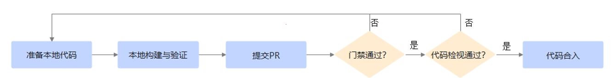

#  PR（Pull Request）操作指南
---

## 1. 🛠️ 准备开发环境

如果您希望参与具体项目贡献（如代码、文档等），首先需要准备 CANN 开发环境。请查阅您感兴趣的开源项目中的 `README.md` 文件，了解环境配置的具体要求。

## 2. 📝 了解开发注意事项

### 2.1 项目特定要求

CANN 社区不同的项目可能使用不同的编程语言、开发框架和编译环境。请在贡献前，仔细阅读对应项目的 `README.md` 文件，了解具体的编码规范和开发要求。

本章节提供基础规范供社区开发者参考：

| 类别  | 规范及要求 |
| --- | --- | 
| 设计 | [安全设计指南](coding-standards/SecureDesign.md) |
| 编码 | [C++编程规范](coding-standards/C++%20Coding%20standards.md) |
| 编码 | [安全编码规范](coding-standards/SecureCoding.md) |
| 编译 | [安全编译选项](coding-standards/SecureCompile(C&C++).md)

### 2.2 版权声明

在参与项目贡献前，请务必仔细阅读项目根目录下的 `LICENSE` 文件，并确保您的所有贡献符合该许可证的要求。

#### 版权声明要求：

请在所有新建的源代码文件（如 `.cpp`, `.h`, `.py` 等）头部添加规范的版权声明。

#### 声明模板：

请根据项目采用的许可证，选择对应的声明模板：

**对于 Apache 2.0、MIT 等常见开源协议** 
    
建议从官方渠道获取标准的版权声明头。你可以访问 [Open Source Initiative](https://opensource.org/licenses) 或该许可证的官方网站查询具体要求。

**对于 CANN Open Software License Agreement Version 2.0**
> **注意**： 以下模板中的\<yyyy\>、[name of copyright owner]需要更改为首次创建年份和贡献者信息（组织或者个人），

```text
Copyright (c) <yyyy> [name of copyright owner].
This program is free software, you can redistribute it and/or modify it under the terms and conditions of
CANN Open Software License Agreement Version 2.0 (the "License").
Please refer to the License for details. You may not use this file except in compliance with the License.
THIS SOFTWARE IS PROVIDED ON AN "AS IS" BASIS, WITHOUT WARRANTIES OF ANY KIND, EITHER EXPRESS OR IMPLIED,
INCLUDING BUT NOT LIMITED TO NON-INFRINGEMENT, MERCHANTABILITY, OR FITNESS FOR A PARTICULAR PURPOSE.
See LICENSE in the root of the software repository for the full text of the License.
```

## 3. 🔄 贡献提交流程



### 3.1 Fork 仓库
- 将目标仓库 Fork 到您的个人账户
- 克隆个人仓库到本地环境
- 在本地分支进行代码、文档等修改

### 3.2 本地验证
- 参考项目说明文档进行本地构建
- 确保代码符合贡献要求

### 3.3 提交 Pull Request
- 代码验证通过后，提交 PR 到目标项目；
- 参照[社区评论命令](https://gitcode.com/cann/infrastructure/blob/main/docs/robot/robot%E4%BD%BF%E7%94%A8%E6%8C%87%E5%8D%97.md)触发门禁测试

### 3.4 代码审查
- **测试未通过**：根据门禁反馈修改代码
- **测试通过**：PR 将分配给 Committer 进行审查，您可以在PR评论区通过`@committer_gitcode_id`提醒 Committer 进行审查，然后及时关注审查意见并进行相应调整。

### 3.5 代码合入
- PR 审查通过后，代码将合入项目主线。

### 📚 扩展资源

- [**GitCode 工作流详细说明**](gitcode-workflow.md) - 完整的代码贡献流程指南
- [**常见问题解答 (FAQs)**](https://gitcode.com/cann/infrastructure/tree/main/docs/FAQ) - 提交 PR 过程中遇到的问题解决方案

---
如您在贡献过程中遇到任何问题，欢迎通过社区渠道（ISSUE、邮件等）寻求帮助！