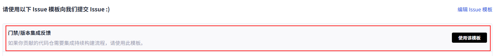
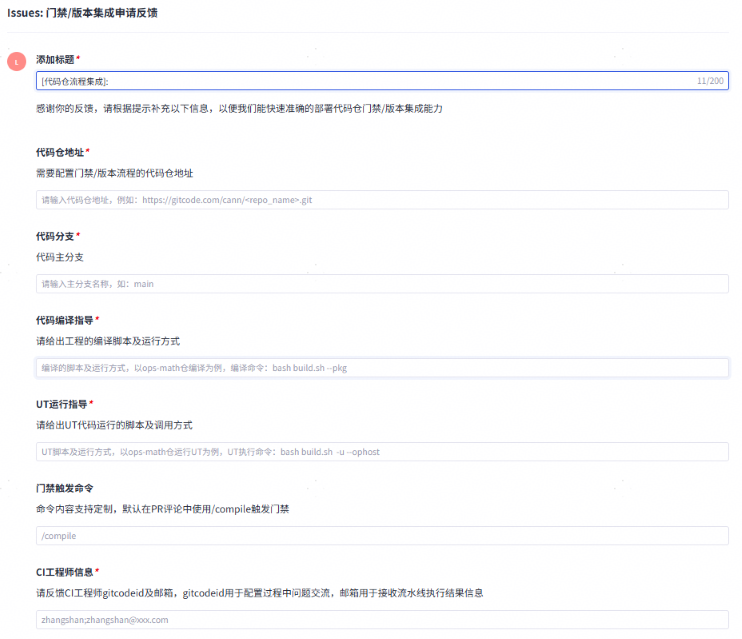
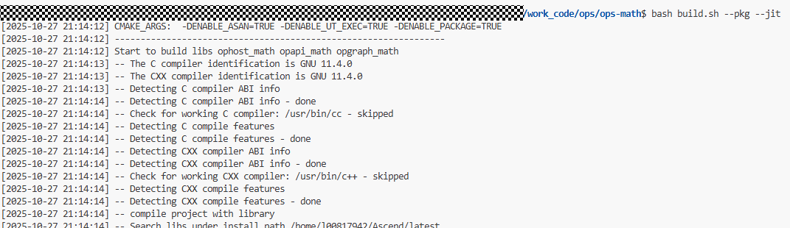
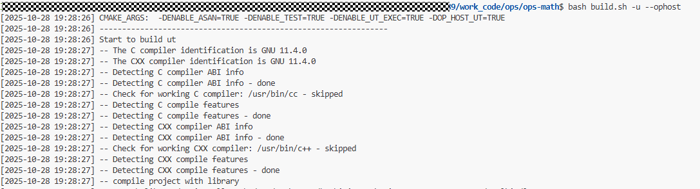
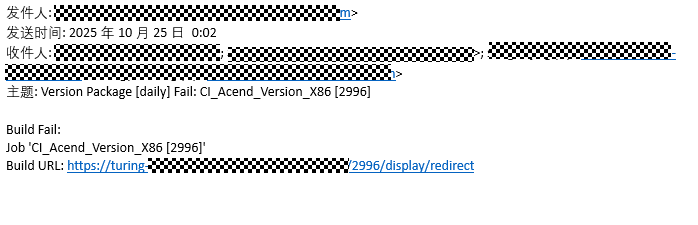
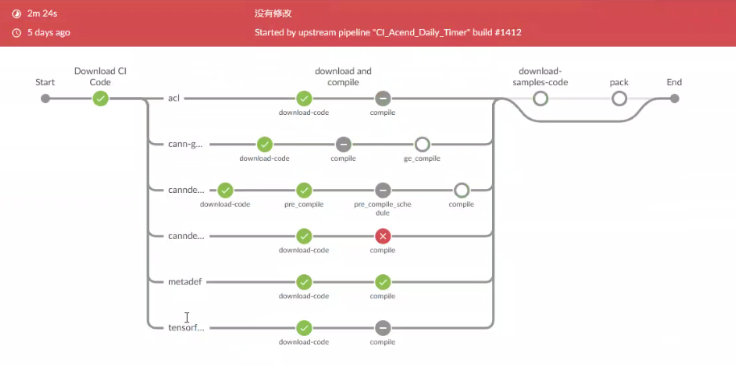

# 代码仓门禁与版本集成流程指导

## 一、使用场景

CANN社区通过持续集成（CI，Continuous Integration）及时发现代码问题，确保代码质量可靠和功能稳定，主要包括以下两种集成场景：

- **代码门禁检查**：开发者向CANN提交代码合入申请后，通过评论中输入特定命令触发门禁检查（包括静态检查、病毒扫描、成分扫描、功能测试等），门禁通过后方可合入代码。相较于版本构建，门禁检查主要关注增量代码的质量风险。

- **每日版本构建**：每日自动触发的流水线，对整体代码进行安全扫描、病毒扫描、成分扫描和功能测试，识别全量风险，确保版本质量。

当开发者向社区贡献代码仓并需要接入持续集成流程时，请参考本指导进行操作。

---

## 二、代码门禁集成

代码门禁集成需由基础设施团队操作完成，捐赠者需提供相应配置信息。可通过在[基础设施仓](https://gitcode.com/cann/infrastructure/issues)提交Issue的方式进行申请。

### 操作步骤

1. **选择Issue模板**
   
   

2. **填写信息并提交Issue**
   
   

   配置信息说明：

   - **代码编译指导（必填）**：例如基础算子仓通过`build.sh`进行编译，需提供具体运行命令（如`bash build.sh --pkg`）。建议脚本支持增量编译以提升效率，详细运行方式可在README中说明。
     
     

   - **UT运行指导（必填）**：以算子仓为例，运行UT脚本及命令为`bash build.sh -u --ophost`，详细运行方式可在README中说明。
     
     

   - **门禁触发命令（可选）**：建议统一使用`/compile`命令触发，如有定制需求请在Issue中说明。

3. **基础设施团队配置**
   
   基础设施团队收到Issue后，将根据提供的信息部署集成流水线。如遇问题，会与协助人沟通解决。

门禁流程包括代码下载、编译构建、代码检查和测试用例等环节，均由基础设施团队默认配置。提交PR触发门禁的详细指导请参考[门禁流程使用指导](../../docs/robot/cann/robot-command.md)。

---

## 三、每日版本集成

每日版本集成流水线同样由基础设施团队操作。提交Issue后，将同步创建门禁集成和每日版本集成流水线。所需配置信息与门禁集成基本一致，如有差异请在Issue中说明。

### 构建流程

1. **代码下载**：默认下载全量master分支代码进行每日构建。
2. **编译构建**：根据提供的命令进行全量版本构建，覆盖X86、Arm平台，输出构建产物。
3. **代码检查**：包括代码安全、病毒扫描、源码成分检查等，当前与门禁流水线检查项一致。
4. **UT测试**：运行测试用例验证功能正确性。版本用例可能与门禁用例不同，请提供详细运行方式。

### 结果通知

每日版本流水线运行结果将发送至CI工程师的邮箱，无论成功与否均会发送。邮件示例如下：

用户可点击邮件中的链接查看详细构建信息：

---

## 四、每日版本产物下载

代码仓每日构建产物将在mirror仓中单独创建目录存放，支持开发者下载使用。

访问地址：`https://mirror.huawei.com/cann/${repo_name}/${branch}/daily/${yyyymm}/${dd}/`

参数说明：
- `${repo_name}`：代码仓名称
- `${branch}`：构建分支
- `${yyyymm}`：构建年月（如202501表示2025年1月）
- `${dd}`：构建日期（如05表示当月5日）

示例：`https://mirror.huawei.com/cann/project_demo/master/daily/202510/20/` 表示project_demo仓master分支在2025年10月20日的构建产物。

[点击访问下载链接](https://mirrors.huaweicloud.com/artifactory/cann-run/)

---

## 五、联系我们

集成流程配置由基础设施团队完成，具体实施人员联系方式请查看[SIG组织信息](../../CANN/sigs/infrastructure/README.md)。

---

## 六、常见问题（FAQ）

我们将根据运作过程中的问题持续完善本FAQ，您也可以通过提交Issue的方式贡献宝贵经验。

[问题反馈地址](https://gitcode.com/cann/infrastructure/issues)

---

**相关链接**
- [门禁流程使用指导](../../docs/robot/cann/robot-command.md)
- [SIG组织信息](../../CANN/sigs/infrastructure/README.md)
- [问题反馈](https://gitcode.com/cann/infrastructure/issues)