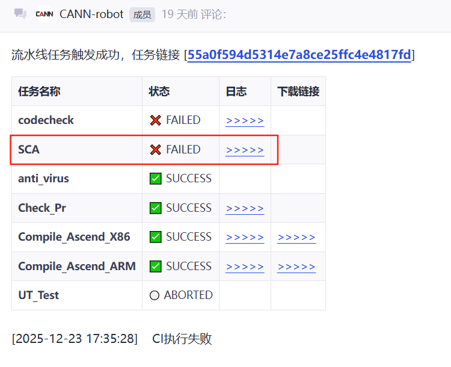
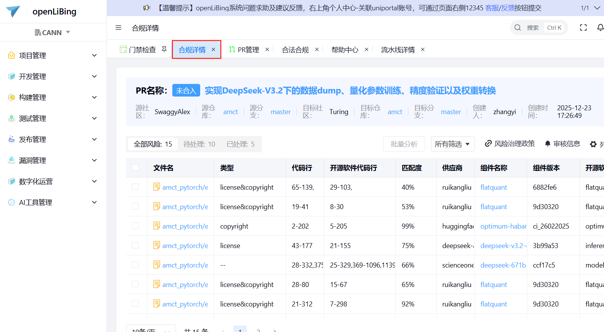

# 开源代码片段引入操作指南
## 1. 引言
### 1.1 目的
本指南旨在规范项目中第三方开源代码片段的引入行为。

### 1.2 适用范围
适用于所有需要在项目中引入第三方开源代码片段的开发者和贡献者。

## 2. 基本原则
### 2.1 风险认知
引入第三方开源代码片段可能存在以下风险：
- **合规风险**：可能产生许可证冲突问题
- **安全风险**：不利于管理开源项目可能出现的漏洞
- **维护风险**：上游项目修复功能性问题时，片段引入方式不利于同步更新

### 2.2 核心原则
- **不鼓励但允许**第三方开源代码片段引用（推荐优先采用包管理器引用方式）
- **严格禁止**引用第三方开源代码时变更其原始许可证和版权声明
- **严格禁止**引入许可证与项目主许可证不兼容的代码片段
> **风险提示**：在 Apache-2.0（宽松许可证）项目中引入 GPL-2.0-only 的代码片段，这将给社区下游用户带来严重的合规风险。

## 3. 自动化检查流程
### 3.1 触发检查
   - PR 合入时自动触发开源代码片段引入检查（SCA）
   - 如 SCA 显示为"FAILED"，需点击上方任务链接进入数字化作业平台处理
   


### 3.2 查看风险列表
   - 点击“合规详情”页签
   - 查看待处理风险详情


### 3.3 操作指引
详细操作请参考：[开源代码片段引用风险分析帮助文档](https://www.openlibing.com/helpCenter?id=59)

## 4. 合规整改指南
确认存在开源代码片段引入后，贡献者需要在引入文件的头部保留原始License和Copyright，并在Third_Party_Open_Source_Software_Notice文件中进行引用声明。

**前置确认**

- 首先确认引入代码的 License 和 Copyright
- 代码片段本身未声明 License 和 Copyright，则继承该片段所在文件的声明
- 所在文件未声明 License 和 Copyright，则继承其所在项目的声明

### 4.1 文件头部声明
在引入开源代码片段的文件头部，请参考以下格式添加声明：

```
[本项目的版权和许可证声明]

[声明此文件包含引用项目的代码片段]

[引用项目的版权声明和许可证文本]
```
**关键要求**：引用项目的版权声明和许可证文本必须严格按照原始项目的表述，不得修改。

**声明示例一**：假设本项目是MyProject（使用Apache-2.0许可证），引入了OtherProject项目（使用MIT许可证）的代码片段：


```

# Copyright (c) [Year] [MyProject Author(s)]. All rights reserved.
#
# Licensed under the Apache License, Version 2.0 (the "License");
# you may not use this file except in compliance with the License.
# You may obtain a copy of the License at
#
#     http://www.apache.org/licenses/LICENSE-2.0
#
# Unless required by applicable law or agreed to in writing, software
# distributed under the License is distributed on an "AS IS" BASIS,
# WITHOUT WARRANTIES OR CONDITIONS OF ANY KIND, either express or implied.
# See the License for the specific language governing permissions and
# limitations under the License.
#
# The code snippet comes from [OtherProject].
#
# Copyright (c) [Year] [OtherProject Author(s)]. All rights reserved.
#
# This file is part of [OtherProject], which is released under the MIT License.
# See the LICENSE file in the root directory of this source tree
# or at https://opensource.org/licenses/MIT for details.
#
# --------------------------------------------------------------------------------
```

**声明示例二**：假设本项目是MyProject（使用CANN2.0许可证），引入了OtherProject项目（使用Apache-2.0许可证）的代码片段：

```
# Copyright (c) [Year] [MyProject Author(s)].
#
# This program is free software, you can redistribute it and/or modify it under the terms and conditions of
# CANN Open Software License Agreement Version 2.0 (the "License").
# Please refer to the License for details. You may not use this file except in compliance with the License.
# THIS SOFTWARE IS PROVIDED ON AN "AS IS" BASIS, WITHOUT WARRANTIES OF ANY KIND, EITHER EXPRESS OR IMPLIED,
# INCLUDING BUT NOT LIMITED TO NON-INFRINGEMENT, MERCHANTABILITY, OR FITNESS FOR A PARTICULAR PURPOSE.
# See LICENSE in the root of the software repository for the full text of the License.
#
# The code snippet comes from [OtherProject].
#
# Copyright (c) [Year] [OtherProject Author(s)]. All rights reserved.
#
# Licensed under the Apache License, Version 2.0 (the "License");
# you may not use this file except in compliance with the License.
# You may obtain a copy of the License at
#
#     http://www.apache.org/licenses/LICENSE-2.0
#
# Unless required by applicable law or agreed to in writing, software
# distributed under the License is distributed on an "AS IS" BASIS,
# WITHOUT WARRANTIES OR CONDITIONS OF ANY KIND, either express or implied.
# See the License for the specific language governing permissions and
# limitations under the License.
#
# --------------------------------------------------------------------------------
 ```

### 4.2 Third_Party_Open_Source_Software_Notice更新
在项目根目录找到 Third_Party_Open_Source_Software_Notice 文件，请参考以下格式添加声明：

```
This project includes code snippet(s) from the following open source project(s):

[引用的开源软件名称和版本]

[引用的开源软件的官方代码仓库地址]

[在本项目中引用代码片段的具体文件路径]

[引用的代码片段的copyright(如引用多个片段且copyright不同，需要全部列出)]

[引用的代码片段的License]

[License全文(如上文已引用过该License全文，可使用"Please see above"代替)]

```
**关键要求**：引用项目的版权声明和许可证文本必须严格按照原始项目的表述，不得修改。

**声明示例**：假设引入了OtherProject 1.3.0（使用Apache-2.0许可证）的代码片段：


```
This project includes code snippet(s) from the following open source project(s):

Software: OtherProject 1.3.0

Official Repository: https://gitcode.com/other/OtherProject

Usage: "
$MyProject/src/application/example.c,
$MyProject/test/framework/example.py,"

Copyright Notice:
Copyright (c) [Year] [OtherProject Author(s)].

License: Apache License V2.0

Full License Text: 
                                 Apache License
                           Version 2.0, January 2004
                        http://www.apache.org/licenses/

   TERMS AND CONDITIONS FOR USE, REPRODUCTION, AND DISTRIBUTION

   1. Definitions.

      "License" shall mean the terms and conditions for use, reproduction,
      and distribution as defined by Sections 1 through 9 of this document.

      "Licensor" shall mean the copyright owner or entity authorized by
      the copyright owner that is granting the License.

      "Legal Entity" shall mean the union of the acting entity and all
      other entities that control, are controlled by, or are under common
      control with that entity. For the purposes of this definition,
      "control" means (i) the power, direct or indirect, to cause the
      direction or management of such entity, whether by contract or
      otherwise, or (ii) ownership of fifty percent (50%) or more of the
      outstanding shares, or (iii) beneficial ownership of such entity.

      "You" (or "Your") shall mean an individual or Legal Entity
      exercising permissions granted by this License.

      "Source" form shall mean the preferred form for making modifications,
      including but not limited to software source code, documentation
      source, and configuration files.

      "Object" form shall mean any form resulting from mechanical
      transformation or translation of a Source form, including but
      not limited to compiled object code, generated documentation,
      and conversions to other media types.

      "Work" shall mean the work of authorship, whether in Source or
      Object form, made available under the License, as indicated by a
      copyright notice that is included in or attached to the work
      (an example is provided in the Appendix below).

      "Derivative Works" shall mean any work, whether in Source or Object
      form, that is based on (or derived from) the Work and for which the
      editorial revisions, annotations, elaborations, or other modifications
      represent, as a whole, an original work of authorship. For the purposes
      of this License, Derivative Works shall not include works that remain
      separable from, or merely link (or bind by name) to the interfaces of,
      the Work and Derivative Works thereof.

      "Contribution" shall mean any work of authorship, including
      the original version of the Work and any modifications or additions
      to that Work or Derivative Works thereof, that is intentionally
      submitted to Licensor for inclusion in the Work by the copyright owner
      or by an individual or Legal Entity authorized to submit on behalf of
      the copyright owner. For the purposes of this definition, "submitted"
      means any form of electronic, verbal, or written communication sent
      to the Licensor or its representatives, including but not limited to
      communication on electronic mailing lists, source code control systems,
      and issue tracking systems that are managed by, or on behalf of, the
      Licensor for the purpose of discussing and improving the Work, but
      excluding communication that is conspicuously marked or otherwise
      designated in writing by the copyright owner as "Not a Contribution."

      "Contributor" shall mean Licensor and any individual or Legal Entity
      on behalf of whom a Contribution has been received by Licensor and
      subsequently incorporated within the Work.

   2. Grant of Copyright License. Subject to the terms and conditions of
      this License, each Contributor hereby grants to You a perpetual,
      worldwide, non-exclusive, no-charge, royalty-free, irrevocable
      copyright license to reproduce, prepare Derivative Works of,
      publicly display, publicly perform, sublicense, and distribute the
      Work and such Derivative Works in Source or Object form.

   3. Grant of Patent License. Subject to the terms and conditions of
      this License, each Contributor hereby grants to You a perpetual,
      worldwide, non-exclusive, no-charge, royalty-free, irrevocable
      (except as stated in this section) patent license to make, have made,
      use, offer to sell, sell, import, and otherwise transfer the Work,
      where such license applies only to those patent claims licensable
      by such Contributor that are necessarily infringed by their
      Contribution(s) alone or by combination of their Contribution(s)
      with the Work to which such Contribution(s) was submitted. If You
      institute patent litigation against any entity (including a
      cross-claim or counterclaim in a lawsuit) alleging that the Work
      or a Contribution incorporated within the Work constitutes direct
      or contributory patent infringement, then any patent licenses
      granted to You under this License for that Work shall terminate
      as of the date such litigation is filed.

   4. Redistribution. You may reproduce and distribute copies of the
      Work or Derivative Works thereof in any medium, with or without
      modifications, and in Source or Object form, provided that You
      meet the following conditions:

      (a) You must give any other recipients of the Work or
          Derivative Works a copy of this License; and

      (b) You must cause any modified files to carry prominent notices
          stating that You changed the files; and

      (c) You must retain, in the Source form of any Derivative Works
          that You distribute, all copyright, patent, trademark, and
          attribution notices from the Source form of the Work,
          excluding those notices that do not pertain to any part of
          the Derivative Works; and

      (d) If the Work includes a "NOTICE" text file as part of its
          distribution, then any Derivative Works that You distribute must
          include a readable copy of the attribution notices contained
          within such NOTICE file, excluding those notices that do not
          pertain to any part of the Derivative Works, in at least one
          of the following places: within a NOTICE text file distributed
          as part of the Derivative Works; within the Source form or
          documentation, if provided along with the Derivative Works; or,
          within a display generated by the Derivative Works, if and
          wherever such third-party notices normally appear. The contents
          of the NOTICE file are for informational purposes only and
          do not modify the License. You may add Your own attribution
          notices within Derivative Works that You distribute, alongside
          or as an addendum to the NOTICE text from the Work, provided
          that such additional attribution notices cannot be construed
          as modifying the License.

      You may add Your own copyright statement to Your modifications and
      may provide additional or different license terms and conditions
      for use, reproduction, or distribution of Your modifications, or
      for any such Derivative Works as a whole, provided Your use,
      reproduction, and distribution of the Work otherwise complies with
      the conditions stated in this License.

   5. Submission of Contributions. Unless You explicitly state otherwise,
      any Contribution intentionally submitted for inclusion in the Work
      by You to the Licensor shall be under the terms and conditions of
      this License, without any additional terms or conditions.
      Notwithstanding the above, nothing herein shall supersede or modify
      the terms of any separate license agreement you may have executed
      with Licensor regarding such Contributions.

   6. Trademarks. This License does not grant permission to use the trade
      names, trademarks, service marks, or product names of the Licensor,
      except as required for reasonable and customary use in describing the
      origin of the Work and reproducing the content of the NOTICE file.

   7. Disclaimer of Warranty. Unless required by applicable law or
      agreed to in writing, Licensor provides the Work (and each
      Contributor provides its Contributions) on an "AS IS" BASIS,
      WITHOUT WARRANTIES OR CONDITIONS OF ANY KIND, either express or
      implied, including, without limitation, any warranties or conditions
      of TITLE, NON-INFRINGEMENT, MERCHANTABILITY, or FITNESS FOR A
      PARTICULAR PURPOSE. You are solely responsible for determining the
      appropriateness of using or redistributing the Work and assume any
      risks associated with Your exercise of permissions under this License.

   8. Limitation of Liability. In no event and under no legal theory,
      whether in tort (including negligence), contract, or otherwise,
      unless required by applicable law (such as deliberate and grossly
      negligent acts) or agreed to in writing, shall any Contributor be
      liable to You for damages, including any direct, indirect, special,
      incidental, or consequential damages of any character arising as a
      result of this License or out of the use or inability to use the
      Work (including but not limited to damages for loss of goodwill,
      work stoppage, computer failure or malfunction, or any and all
      other commercial damages or losses), even if such Contributor
      has been advised of the possibility of such damages.

   9. Accepting Warranty or Additional Liability. While redistributing
      the Work or Derivative Works thereof, You may choose to offer,
      and charge a fee for, acceptance of support, warranty, indemnity,
      or other liability obligations and/or rights consistent with this
      License. However, in accepting such obligations, You may act only
      on Your own behalf and on Your sole responsibility, not on behalf
      of any other Contributor, and only if You agree to indemnify,
      defend, and hold each Contributor harmless for any liability
      incurred by, or claims asserted against, such Contributor by reason
      of your accepting any such warranty or additional liability.

   END OF TERMS AND CONDITIONS

   APPENDIX: How to apply the Apache License to your work.

      To apply the Apache License to your work, attach the following
      boilerplate notice, with the fields enclosed by brackets "[]"
      replaced with your own identifying information. (Don't include
      the brackets!)  The text should be enclosed in the appropriate
      comment syntax for the file format. We also recommend that a
      file or class name and description of purpose be included on the
      same "printed page" as the copyright notice for easier
      identification within third-party archives.

   Copyright [yyyy] [name of copyright owner]

   Licensed under the Apache License, Version 2.0 (the "License");
   you may not use this file except in compliance with the License.
   You may obtain a copy of the License at

       http://www.apache.org/licenses/LICENSE-2.0

   Unless required by applicable law or agreed to in writing, software
   distributed under the License is distributed on an "AS IS" BASIS,
   WITHOUT WARRANTIES OR CONDITIONS OF ANY KIND, either express or implied.
   See the License for the specific language governing permissions and
   limitations under the License.

```

## 5. 责任分工
### 5.1 开发者责任
- 确保引入的代码片段符合项目要求
- 提供完整的来源信息和声明
- 配合完成合规性检查

### 5.2 维护者责任
- 审核引入的合理性和必要性
- 验证合规声明的完整性
- 确保项目整体的许可证无冲突

## 6. 求助通道
合规问题可能对项目和参与者造成严重影响，请务必谨慎处理。如执行过程中有疑问，请向[社区安全SIG](https://gitcode.com/cann/community/blob/master/CANN/sigs/security/README.md)进行求助，或[提交ISSUE](https://gitcode.com/cann/community/issues)咨询。
