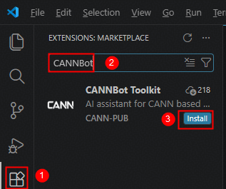
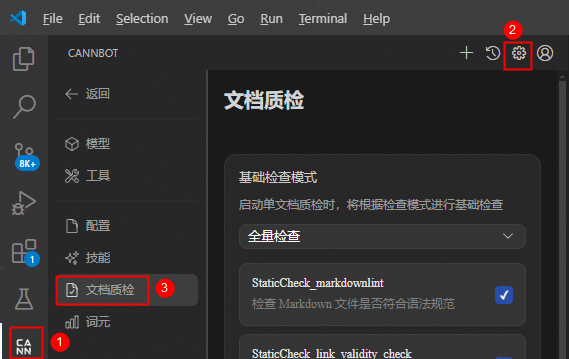

# 文档开发工具

## 工具介绍

**声明：本工具当前为测试版本，后续仍会持续调整，建议不要直接应用于商发产品中，如遇问题请提Issue。**

CANNBot是一款专为CANN社区开发人员打造的AI辅助工具，基于开源项目[Continue](https://github.com/continuedev/continue)二次开发，旨在显著提升开发效率与质量。

开发者在日常开发中，可借助本工具快速完成代码续写、对话问答、文档开发等任务，实现高效率、高质量的工作成果。需要说明的是，本文聚焦文档开发场景，重点介绍工具如何辅助文档写作、质检等。

## 工具安装

在Visual Studio Code中搜索工具插件并安装：



## 功能总览

针对文档开发场景，本工具目前提供如下能力：

- **文档生成**

  针对CANN领域中可结构化的文档，工具提供基于模型AI的辅助学习能力，能够同步生成与软件实现一致的文档，从而提升文档写作效率。

  注意：目前仅支持生成算子对应的aclnn API文档，其他组件文档生成能力**正在建设中**。

- **文档质检**

  针对markdown格式的文档，提供静态检查（StaticCheck）、基础语义检查（AICheck）、领域规则检查（DomainCheck）等能力，希望能提高文档质量。

  |检查项|说明|
  |-----|-----|
  |[StaticCheck_markdownlint](#staticcheck_markdownlint)|Markdown基础语法检查|
  |[StaticCheck_tag_closed](#staticcheck_tag_closed)|HTML标签闭合语法检查|
  |[StaticCheck_link_validity](#staticcheck_link_validity)|链接可访问性检查|
  |[StaticCheck_resource_existence](#staticcheck_resource_existence)|资源有效性检查|
  |[StaticCheck_codespell](#staticcheck_codespell)|单词拼写检查|
  |[StaticCheck_filename](#staticcheck_filename)|Markdown文件命名规范检查|
  |[StaticCheck_punctuation](#staticcheck_punctuation)|标点符号检查|
  |[StaticCheck_compliance](#staticcheck_compliance)|合规性检查|
  |[AICheck](#aicheck)|上下文语义基础检查|
  |[DomainCheck_aclnn_API](#domaincheck_aclnn_api)|aclnn API文档检查|
  |[DomainCheck_AscendC_API](#domaincheck_ascendc_api)|Ascend C API文档检查|
  
## 工具配置

工具辅助文档写作或质检过程中，支持自行配置相关能力。以文档质检配置为例，可设置检查模式和对应的检查项：



## 质检项介绍

### StaticCheck_markdownlint

针对markdown格式文档进行语法和格式的基础检查，具体的规则介绍和正反例请参考[开源项目README](https://github.com/DavidAnson/markdownlint/blob/main/README.md)。

### StaticCheck_tag_closed

检查文档里HTML标签闭合问题。请注意，代码块里的HTML标签将不会扫描。

- 反例：

  ```text
    <table>
      <tr>
        <th>Header 1
        <th>Header 2</th>   <!-- 错误1：未闭合的<th> -->
      <tr>                  <!-- 错误2：未闭合的<tr> -->
        <td>Data 1<td>      <!-- 错误3：自闭合<td> -->
        <td>Data 2</td>
    </table>                <!-- 错误4：未闭合的<tr>导致结构错乱 -->
  ```
  
- 正例：

  ```text
    <table>
      <tr>
        <th>Header 1</th>
        <th>Header 2</th>
      </tr>
      <tr>
        <td>Data 1</td>
        <td>Data 2</td>
      </tr>
    </table>
  ```

### StaticCheck_link_validity

检查文档里出现的所有链接是否有效。

- 反例：

    ```text
      <!-- 拼写错误导致 404 -->
    ```

- 正例：

    ```text
    
    ```

### StaticCheck_resource_existence

检查本地资源是否有效，例如图片或链接文件等。

- 反例：

  ```text
    <!-- 图片相对路径错误 -->
  ```
  
- 正例：

  ```text
  
  ```

### StaticCheck_codespell

检查文档中英文单词拼写错误，详细信息可参考[codespell-project](https://github.com/codespell-project/codespell)。

如有特殊单词需加入忽略清单，可联系[文档管理员](https://gitcode.com/gitcode-chenjiao)。

### StaticCheck_filename

检查开源文件命名是否规范，仅支持纯英文字符（英文字母、数字、中横线-、下划线_），长度不超过100个字符。

- 反例：

  ```text
  docs/算子_README2%.md  <!-- 文件命名带中文字符、特殊字符 -->
  ```
  
- 正例：

  ```text
  docs/OP_README2.md
  ```
  
### StaticCheck_punctuation

检查文档中标点符号是否规范，包括标点符号重复/缺失/是否配对使用、空格是否多余/缺失、中英文符号混用等。

- 反例：

  ```text
  例1：本接口为试验特性，后续版本可能存在变更，，暂不支持应用于商用产品中。   <!-- 逗号重复 -->
  例2：本接口为试验特性，后续版本可能存在变更，暂不支持应用于商用产品中      <!-- 句末符号缺失 -->
  例3：本接口为试验特性，后续版本可能存在变更，  暂不支持应用于商用产品中。  <!-- 多余空格 -->
  例4：本接口为试验特性，后续版本可能存在变更,暂不支持应用于商用产品中.     <!-- 中文语句用英文逗号/句号  -->
  ```
  
- 正例：

  ```text
  本接口为试验特性，后续版本可能存在变更，暂不支持应用于商用产品中。
  ```

### StaticCheck_compliance

检查文档中的术语及专有名词是否符合规范或领域常识，同时检查是否存在个人敏感信息或违反法律法规的描述。

- 反例：

  ```text
  例1：dvpp库提供了视频和图像解码、缩放等预处理功能。                 <!-- dvpp术语不符合领域规范（改为大写） -->
  例2：若算子执行异常，可联系CANN工程师xxx@qq.com或18312312312。    <!-- 个人敏感信息需删除或转换表达方式 -->
  例3：该接口当前暂不支持AtlasA3训练系列产品。                      <!-- 产品型号不符合领域规范 -->
  ```
  
- 正例：

  ```text
  例1：DVPP库提供了视频和图像解码、缩放等预处理功能。
  例2：若算子执行异常，可联系CANN工程师。
  例3：该接口当前暂不支持Atlas A3 训练系列产品。
  ```

### AICheck

检查上下文语义正确性、可读性，主要包括如下几项：

- 中文错别字
- 中文重复字/英文重复单词
- 内容模糊、歧义或语病
- 内容冗余性
- 内容一致性

### DomainCheck_aclnn_API

检查CANN算子库aclnn API文档的规范性、正确性、完备性、可读性，写作模板详见[aclnn API文档模板](https://gitcode.com/cann/ops-math/wiki/aclnn%20API%E6%96%87%E6%A1%A3%E6%A8%A1%E6%9D%BF)。

### DomainCheck_AscendC_API

检查CANN Ascend C API文档的规范性、正确性、完备性、可读性，写作规范请参见[Tanh样例](https://gitcode.com/cann/asc-devkit/blob/master/docs/api/context/Tanh.md)。
