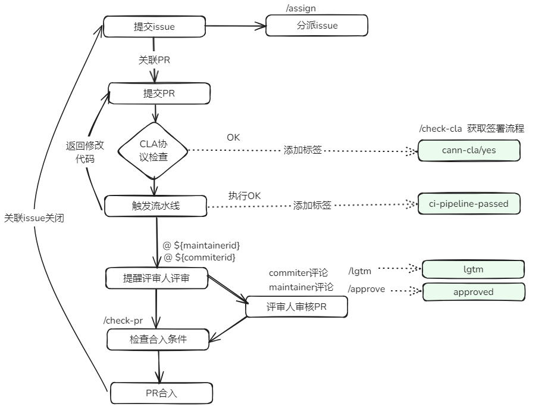
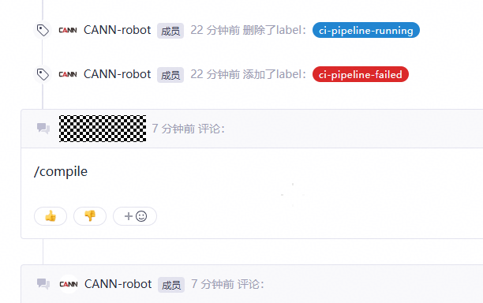
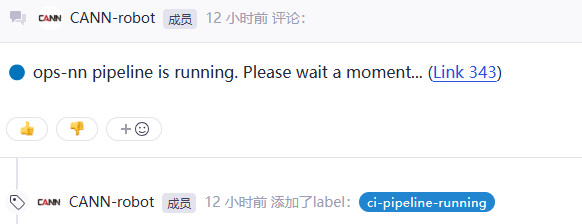
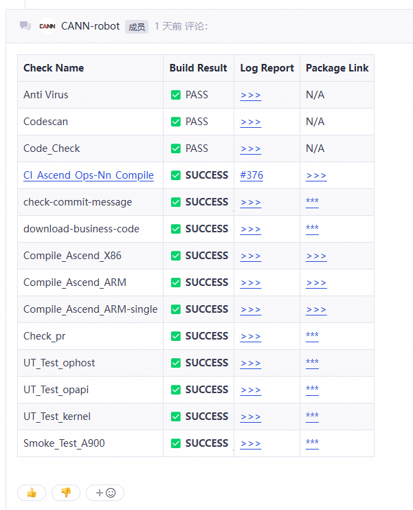

****

##  🚀 CANN社区用户交互流程

CANN社区中所有项目均由Bot维护，这意味着开发人员可以在每个Pull Request或者Issue下面可以通过评论触发Bot命令， 主要交互流程图如下：

##  💻 CANN门禁系统说明

CANN社区代码均托管在gitcode上，为了保证代码提交质量，开发者在gitcode提交PR时，会自动触发门禁执行编码规范检查、构建、UT、冒烟等检查，最后将门禁检查结果返回到PR评论中，帮助开发者定位问题及maintainer检视代码。

### 📌 门禁触发方式

开发者可通过在 PR 中输入/compile手动触发门禁检查：

✅ 注意：仅当 PR 中有评论为/compile 时，门禁流水线才会被触发。

### 🕒 门禁开始运行标志

当门禁任务启动后，系统会在 PR 评论中提供实时构建日志链接，开发者可点击链接查看任务执行进度：

### 📊 门禁检查项

门禁系统包含以下核心检查项：

| 检查项                | 功能描述                        | 
| --------------------- | ------------------------------- |  
| Anti Virus           | 病毒与投毒检测，覆盖通用、Turing-C/C++、Turing-Python 等多个规则集，防止恶意代码注入                    | 
| Codescan   | 	静态扫描代码片段，识别潜在安全风险和代码重复               |
| Code_Check            | 	编码规范与安全合规性检查                  |
| Compile_Ascend_X86         | 在 x86-64 环境下构建并验证包的完整性  | 
| Compile_Ascend_ARM       | 在 aarch64 环境下构建并验证包的完整性 | 
| Check_pr       | 检查 PR 标题、描述、分支命名规范、是否包含有效变更、是否关联 Issue 等 | 
| UT_Test*       | 单元测试（覆盖 OPHost、OPAPI、Kernel 等模块） |
| Smoke_Test*      | 冒烟测试：验证核心功能在典型场景下的可用性 | 

### 🔍 检查规则详解

<table>
<tbody><tr>
<th>检查项</th>
<th>检查规则</th>
</tr>
<tr>
<td>Anti Virus</td>
<td>防投毒规则：通用检查规则集、Turing-C/C++、Turing-Python</td>
</tr>
<tr>
<td rowspan="2">Code_Check </td>
<td>敏感词规则：密钥类、协议类、命令类、隐私类、禁用词汇类、公共地址类、日志类、硬编码类、web认证类、芯片类</td>
</tr>
<tr>
<td>代码规则：质量类（除数不为零等）、安全类（秘钥不应过短等）</td>
</tr>
</tbody>
</table>
✅ 所有规则均基于 CANN 社区编码规范与安全标准制定，旨在提升代码可维护性与安全性。

### ✅ 门禁检查结果反馈

- **通过**：系统自动为 PR 添加标签 ci-pipeline-passed，表示所有检查项均通过。
- **失败**：系统会在 PR 评论中详细列出失败项、错误位置与建议修复方式，开发者需根据提示修改代码后重新触发 /compile 命令。

### 💡 建议

1. CANN 门禁系统是保障代码质量的第一道防线，开发者应主动理解门禁规则，避免因低级错误导致 CI 失败。
2. 建议在提交 PR 前使用本地工具进行预检，可大幅提升门禁通过率，缩短代码评审周期。
3. 请勿提交包含敏感信息（如密钥、内网地址、日志泄露）的代码。
4. 如门禁失败，请仔细阅读评论中的错误信息，针对性修复后再重新触发/compile。

## 🎯 如需了解详细的命令，可参考下方详细表格

<table class="command">
    <thead>
        <tr>
            <th width="15%">命令</th>
            <th width="15%">示例</th>
            <th width="10%">使用范围</th>
            <th width="30%">描述</th>
            <th width="15%">面向对象</th>
            <th width="15%">使用仓库</th>
        </tr>
    </thead>
    <tbody>
        <tr>
            <td>
                /check-cla
            </td>
            <td style="white-space:nowrap;">
                /check-cla
            </td>
            <td>
                <strong>Pull Request</strong>
            </td>
            <td>
                强制重新检查Pull Request的CLA状态。
                如果Pull Request的提交者已经签署了CLA协议，则<strong>cann-cla/yes</strong>标签将会被添加到Pull Request中；如果没有，则标签<strong>cann-cla/no</strong>将被添加到Pull Request中。
            </td>
            <td>
                所有开发者
            </td>
            <td>
                所有仓库
            </td>
        </tr>
        <tr>
            <td>
                /cla cancel
            </td>
            <td style="white-space:nowrap;">
                /cla cancel
            </td>
            <td>
                <strong>Pull Request</strong>
            </td>
            <td>
                强制删除<strong>cann-cla/yes</strong>标签。
            </td>
            <td>
               仓库管理员
            </td>
            <td>
                所有仓库  
            </td>
        </tr>
        <tr>
           <td>
                /compile
           </td>
           <td style="white-space:nowrap;">
                /compile
           </td>
           <td>
                <strong>Pull Request</strong>
            </td>
           <td>
                触发编译CodeArts流水线。
                编译通过后，该Pull Request会被打上<strong>ci-pipeline-passed</strong>的标签。若编译失败，该Pull Request会被打上<strong>ci-pipeline-failed</strong>的标签。
           </td>
           <td>
              所有开发者
           </td>
           <td>
              所有仓库
           </td>
        </tr>
        <tr>
            <td>
                /lgtm
            </td>
            <td style="white-space:nowrap;">
                /lgtm
            </td>
            <td>
                <strong>Pull Request</strong>
            </td>
            <td>
                添加用于代表代码已经评审过的标签 <strong>lgtm</strong>。      
            </td>
            <td>
              仓库所属sig组的reviewers
            </td>
            <td>
                所有仓库
            </td>
        </tr>
        <tr>
            <td>
                /lgtm cancel
            </td>
            <td style="white-space:nowrap;">
                /lgtm cancel
            </td>
            <td>
                <strong>Pull Request</strong>
            </td>
            <td>
                移除用于代表代码已经评审过的标签<strong>lgtm</strong>。
            </td>
            <td>
              仓库所属sig组的reviewers
            </td>
            <td>
                所有仓库
            </td>
        </tr>
        <tr>
            <td>
                /approve
            </td>
            <td style="white-space:nowrap;">
                /approve
            </td>
            <td>
                <strong>Pull Request</strong>
            </td>
            <td>
                添加用于代表committers同意合并的标签 <strong>lgtm</strong>。      
            </td>
            <td>
              仓库所属sig组的committers
            </td>
            <td>
                所有仓库
            </td>
        </tr>
        <tr>
            <td>
                /approve cancel
            </td>
            <td style="white-space:nowrap;">
                /approve cancel
            </td>
            <td>
                <strong>Pull Request</strong>
            </td>
            <td>
                移除用于代表committers同意合并的标签<strong>approved</strong>。
            </td>
            <td>
              仓库所属sig组的committers
            </td>
            <td>
                所有仓库
            </td>
        </tr>
        <tr>
            <td>
                /check-pr
            </td>
            <td style="white-space:nowrap;">
                /check-pr
            </td>
            <td>
                <strong>Pull Request</strong>
            </td>
            <td>
                检查Pull Request中的标签是否满足条件，如果满足条件，则合并Pull Request。
            </td>
            <td>
                任何人都可以在Pull Request上触发此命令
            </td>
            <td>
                所有仓库
            </td>
        </tr>
        <tr>
            <td>
                /merge
            </td>
            <td style="white-space:nowrap;">
                /merge
            </td>
            <td>
                <strong>Pull Request</strong>
            </td>
            <td>
                添加用于代表branch_keeper同意合并的标签 <strong>keeper_approved</strong>。
            </td>
            <td>
                仓库对应分支的branch_keeper
            </td>
            <td>
                所有仓库
            </td>
        </tr>
        <tr>
            <td>
                /kind **
            </td>
            <td style="white-space:nowrap;">
                /kind bug, 
                 **可接受大小写字母、数字、中划线、下划线，
                 对于下面的**规则通用
            </td>
            <td>
                <strong>Pull Request</strong>
                 <strong>Issue</strong>
            </td>
            <td>
                添加标签 <strong>kind/bug</strong>。
            </td>
            <td>
                仓库管理员可以直接添加；其他人可以使用评论添加标签，如kind/AI，前提是仓库中必须存在此标签，否则添加不上
            </td>
            <td>
                所有仓库
            </td>
        </tr>
        <tr>
            <td>
                /remove-kind **
            </td>
            <td style="white-space:nowrap;">
                /remove-kind bug
            </td>
            <td>
                <strong>Pull Request</strong>
                 <strong>Issue</strong>
            </td>
            <td>
                移除标签 <strong>kind/bug</strong>。
            </td>
            <td>
                所有人
            </td>
            <td>
                所有仓库
            </td>
        </tr>
        <tr>
            <td>
                /priority **
            </td>
            <td style="white-space:nowrap;">
                /priority high
            </td>
            <td>
                <strong>Pull Request</strong>
                 <strong>Issue</strong>
            </td>
            <td>
                添加标签 <strong>priority/high</strong>。
            </td>
            <td>
                仓库管理员可以直接添加；其他人可以使用评论添加标签，如kind/AI，前提是仓库中必须存在此标签，否则添加不上
            </td>
            <td>
                所有仓库
            </td>
        </tr>
        <tr>
            <td>
                /remove-priority **
            </td>
            <td style="white-space:nowrap;">
                /remove-priority high
            </td>
            <td>
                <strong>Pull Request</strong>
                 <strong>Issue</strong>
            </td>
            <td>
                移除标签 <strong>priority/high</strong>。
            </td>
            <td>
                所有人
            </td>
            <td>
                所有仓库
            </td>
        </tr>
        <tr>
            <td>
                /sig **
            </td>
            <td style="white-space:nowrap;">
                /sig AI
            </td>
            <td>
                <strong>Pull Request</strong>
                 <strong>Issue</strong>
            </td>
            <td>
                添加标签 <strong>sig/AI</strong>。
            </td>
            <td>
                仓库管理员可以直接添加；其他人可以使用评论添加标签，如kind/AI，前提是仓库中必须存在此标签，否则添加不上
            </td>
            <td>
                所有仓库
            </td>
        </tr>
        <tr>
            <td>
                /remove-sig **
            </td>
            <td style="white-space:nowrap;">
                /remove-sig AI
            </td>
            <td>
                <strong>Pull Request</strong>
                 <strong>Issue</strong>
            </td>
            <td>
                移除标签 <strong>sig/AI</strong>。
            </td>
            <td>
                所有人
            </td>
            <td>
                所有仓库
            </td>
        </tr>
        <tr>
            <td>
                /assign [[@]...]
            </td>
            <td style="white-space:nowrap;">
                /assign 
                 /assign @cann-robot
            </td>
            <td>
                 <strong>Issue</strong>
            </td>
            <td>
                为Issue指派一位负责人。
            </td>
            <td>
                所有人
            </td>
            <td>
                所有仓库
            </td>
        </tr>
        <tr>
            <td>
                /unassign [[@]...]
            </td>
            <td style="white-space:nowrap;">
                /unassign 
                 /unassign @cann-robot
            </td>
            <td>
                 <strong>Issue</strong>
            </td>
            <td>
                取消Issue指派的负责人。
            </td>
            <td>
                所有人
            </td>
            <td>
                所有仓库
            </td>
        </tr>
    </tbody>
</table>