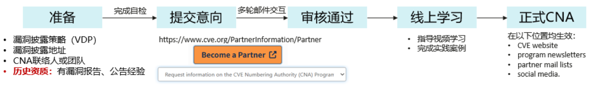
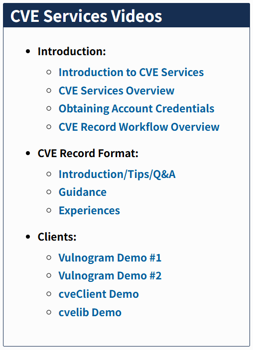
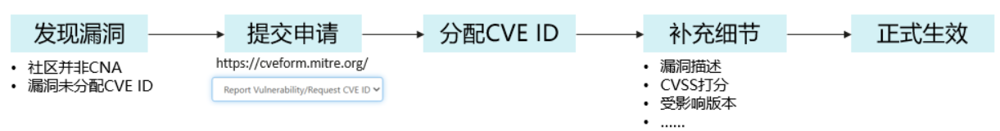

# CVE ID申请指导书 

## 1 目的
为确保CANN开源社区在漏洞披露过程中，能够使用CVE ID披露漏洞，特制定本指导书。

## 2 适用范围
本指导书适用于CANN开源社区，为在漏洞披露过程中申请CVE ID的指导。

## 3 背景
CVE ID作为业界最权威的漏洞编号体系，CANN社区漏洞披露时也需要申请CVE ID。 本文第四章为通过申请CNA资质后自主分配CVE ID的指导，第五章为不申请CNA资质直接申请CVE ID的指导，CANN社区当前参考第五章指导单点申请CVE ID。

## 4 CNA资质申请流程

### 4.1 准备阶段
参考：[https://www.cve.org/PartnerInformation/Partner](https://www.cve.org/PartnerInformation/Partner)，申请CNA资质前，应先自检是否已具备申请成为CNA的相关要求，主要包括：
1. 已发布漏洞披露策略（VDP，Vulnerability Disclosure Policy）
2. 已具备公开披露漏洞的渠道，例如独立的安全公告网页
3. 已明确负责CNA联络的负责人或责任团队
4. 加分项：历史已有漏洞报告或公开披露漏洞公告

> 注：加分项非必选项，对于曾经贡献过漏洞的组织或个人（厂商、研究者、开源社区、CERT组织、托管服务、奖励计划运营方、联盟组织等），申请CNA更有优势。

### 4.2 提交意向与审核
自检完成后，可以访问 [https://cveform.mitre.org/](https://cveform.mitre.org/) 开始申请，request type 选择：“Request information on the CVE Numbering Authority (CNA) Program”。

根据页面指示填写对应项目，并在如下对话框中声明申请CNA的诉求以及明确说明和举证如下信息：
1. 申请主体，例如XX社区，并附上社区的访问主页链接（https://www.hiascend.com/cann）
2. 漏洞披露策略（VDP，Vulnerability Disclosure Policy）的链接或正文全文（https://gitcode.com/cann/community/blob/master/security/security.md）
3. 已建立的漏洞披露渠道链接，或证明（https://digital.hicann.cn/#/vulnerability_notice）
4. 过往已披露的漏洞案例，或申请CVE ID的案例
5. 安全团队的组织架构、职责要求，以及联络人的联系方式（https://gitcode.com/cann/community/tree/master/CANN/sigs/security）

以上在表单中可以粗略提供，提交后，MITRE会对比资质要求补充、举证等，提供完整材料后，审核周期约需4~6周。

### 4.3 参加线上培训和实践
MITRE审核通过后，需要在线完成课程学习与实践案例的演练：[https://www.cve.org/ResourcesSupport/Resources#cnaOnboarding](https://www.cve.org/ResourcesSupport/Resources#cnaOnboarding)，完成CVE Services Videos模块中的学习与实践。

### 4.4 完成申请
完成以上步骤后，可以成为CNA成员，这个成员资质会在CVE网站、项目 newsletters、伙伴邮件列表、社交媒体中体现生效。

## 5 无CNA资质的CVE ID申请流程

### 5.1 前提条件
参考：[https://www.cve.org/About/Process](https://www.cve.org/About/Process)，漏洞申请CVE ID需要具备以下条件：
1. 漏洞已完成修补，至少需要有漏洞对应修补的 commit
2. 漏洞所在的主体组织（软件所属社区、产品所属厂商等）不具备 CNA资质
3. 漏洞尚未被分配任何CVE ID

### 5.2 提交申请和获得CVE ID
访问 [https://cveform.mitre.org/](https://cveform.mitre.org/) 开始申请，request type 选择：“Report Vulnerability/Request CVE ID”。

根据页面指示填写对应条目，可选项可先不填写，MITRE将会在24~72小时内反馈一个 RESERVED 状态的 CVE ID，该CVE ID的详细信息在MITRE网站暂不可见，但可用于受限范围内的交流沟通，例如与下游合作伙伴协商公开披露时间等。

### 5.3 补充完善细节
收到CVE ID之后，在准备正式披露的时候补充完善漏洞的所有细节，包括：
- 受影响的软件版本
- 修复的版本
- 漏洞类型
- 漏洞根因
- 漏洞影响
- 参考链接（一个，例如 commit 链接，或安全公告链接）

### 5.4 正式生效
完善细节后，即可正式发布CVE ID及其细节。

> 注：正式发布CVE ID后，将会完全公开，如果需要与下游伙伴协同处理，应在准备正式公开披露时再告知MITRE正式发布CVE ID，以免扩大影响。

## 6 指导书修改记录
| 版本 | 拟制/修订责任人 | 拟制/修订日期 | 修订内容及理由 | 
|------|----------------|--------------|----------------|
| V1.0 |        汤浩然       | 2026-3-20   | 1、首稿        |        |
| V1.1 |        刘杰峰        | 2026-4-8   | 正文描述适配CANN社区修订        |        |

