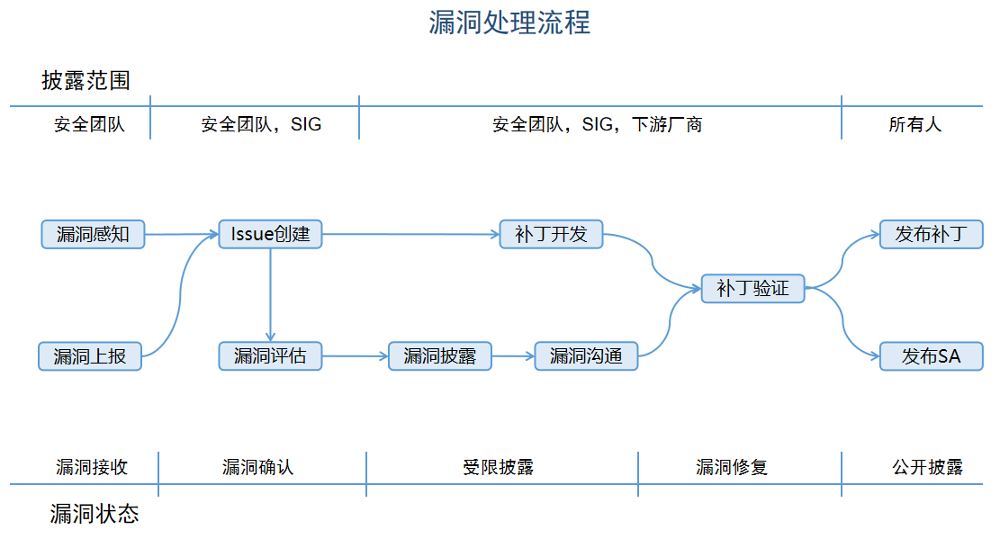

# 漏洞管理
CANN社区非常重视社区版本的安全性，CANN安全团队负责接收、调查、处理和披露CANN社区相关的安全漏洞。我们鼓励漏洞研究人员和行业组织主动将CANN社区的疑似安全漏洞报告给CANN社区安全团队。我们会快速的响应、分析和解决上报的安全问题或安全漏洞。

     

在这里我们主要介绍流程中漏洞上报、漏洞评估、受限披露和公开披露这四部分内容。

## 漏洞上报
如果您认为 CANN 产品存在一个疑似安全漏洞，我们希望您将漏洞上报给CANN 社区，并与我们配合以负责任的方式修复和披露该问题。

### 邮件上报方式
您可以通过email将CANN产品的潜在安全漏洞发送到CANN[security SIG邮箱](security@cann.osinfra.cn)。因为漏洞信息比较敏感，建议您使用安全团队邮箱[PGP公钥](PGP/CANN_public_key.asc)对邮件信息进行加密。 安全团队成员信息详见[security SIG介绍](../CANN/sigs/security/README.md)。

### 邮件上报内容
为了便于快速的确认和验证疑似漏洞，请在漏洞上报邮件中包含但不限于以下内容：
- 基本信息：包括漏洞影响的模块、漏洞的触发条件和成功利用后对系统的影响等
- 技术细节：包括系统配置、定位方法、Exploit 的描述、POC、问题重现方法和步骤等
- 修复方案建议
- 上报者的组织和联系方式
- 上报者可能的漏洞披露计划

### 邮件响应时间
我们将在 48 小时内响应通过邮箱上报的疑似安全漏洞，并向上报者反馈漏洞处理的进展。

## 漏洞评估
安全团队根据漏洞影响等级及漏洞发生概率共同评估漏洞处理优先级。 

### 评估标准
#### 影响等级
CANN社区采用 CVSS v3 对漏洞影响等级进行评估，CVSS V3 通过以下向量来评估一个漏洞的影响：
- 攻击向量（Attack Vector）-表示攻击的“远程性”以及如何利用此漏洞
- 攻击复杂性（Attack Complexity）-讲述攻击执行的难度以及成功进行攻击需要哪些因素
- 用户交互（User Interaction）-确定攻击是否需要用户参与
- 所需的权限（Privileges Required）-记录成功进行攻击所需的用户身份验证级别
- 范围（Scope）-确定攻击者是否可以影响具有不同权限级别的组件
- 机密性（Confidentiality Impact）-衡量信息泄露给非授权方后导致的影响程度
- 完整性（Integrity Impact）-衡量信息被篡改后导致的影响程度
- 可用性（Availability Impact）-衡量用户在需要访问数据或服务时受影响的程度

漏洞业务影响等级及其对应的漏洞评分如下：
| 漏洞业务影响等级  | 漏洞评分 |
| -------------    | ----------- |
| 严重             | 9.0-10.0    |
| 高               | 7.0-8.9     |
| 中               | 4.0-6.9     |
| 低               | 0.1-3.9     |

#### 发生概率
CANN社区参考CVSS 3.1，从实际攻击场景中的环境因素、漏洞利用成熟度，来评定漏洞影响发生的概率：
| 利用成熟度/环境因素  | 漏洞可成功利用已公开  | 漏洞可成功利用未公开 | 漏洞不可成功利用 |   
|-------------|-------------|------------|----------|
| ETI环境       | 高          | 中          | 低        |   

说明：
- 漏洞利用成熟度为“可成功利用已公开”，其中，“可成功利用”指可利用漏洞稳定造成相应的影响，“已公开”指漏洞EXP或者利用工具已公开，或者证明漏洞已经被外界利用，或者外界公开指明为华为云服务的漏洞
- 漏洞利用成熟度为“漏洞可成功利用未公开”，其中，“未公开”指漏洞EXP或者利用工具没有公开，或者已公开POC代码（仅实现概念性验证，无法完整实现漏洞攻击），或者发现漏洞可利用但是未被外界公开
- 漏洞不可成功利用包括未发现任何利用方法，或已公开的POC、EXP经验证对实际环境无效

### 评估步骤
对漏洞进行评估时，可根据下述步骤进行操作：
- 设定可能的攻击场景，基于攻击场景评分
- 确定漏洞组件（Vulnerable Component）和受影响组件（Impact Component）
- 选择基础评估指标的值：通过可利用指标（攻击向量/攻击复杂度/所需权限/用户交互/范围）和受影响指标（机密性/完整性/可用性）给出漏洞影响等级评估
- 通过实际攻击场景中的环境因素和漏洞利用成熟度给出漏洞发生概率评估

### 漏洞优先级划分
| 发生概率\影响等级  | 严重  | 高 | 中 | 低 |   
|-------------|-------------|------------|----------|----------|
| 高       | 1级         | 2级         | 3级        | 3级        |
| 中       | 2级         | 3级         | 4级        | 5级        |
| 低       | 5级         | 5级         | 6级        | 6级        | 

漏洞优先级及其相应的处理时间如下：
| 漏洞优先级  | 漏洞确认时间  | 
|-------------|-------------|
| 1-2级       | 1天       | 
| 3-4级       | 3天       | 
| 5-6级       | 7天       | 

## 受限披露
针对优先级较高的漏洞，CANN社区会提前与下游厂商披露漏洞，并针对漏洞修补细则做相应的沟通。

### 漏洞披露
漏洞披露遵从need-to-know总体原则，实施阶段须遵从受影响披露（仅向受影响下游厂商披露漏洞）、相关性披露（仅披露下游厂商相关版本漏洞）、保密性披露（仅向需要知道该漏洞的下游厂商人员披露）三原则，同时应遵从相关法律法规要求。
 
具体披露范围如下：
- 需对漏洞处理优先级为1~3级的业界已知漏洞进行披露
- 对于处理优先级1~2级的漏洞，需在漏洞受影响版本和修补计划明确后及时发布安全通告（SA），修补方案发布后更新安全通告（SA）
  
### 漏洞沟通
下游厂商若对漏洞修补方案有异议，可以向我们反馈，我们将与您沟通达成一致意见后，按照沟通意见提供补丁或版本。

## 公开披露
为了保护CANN社区用户的安全，在进行调查、修复和发布安全公告之前，CANN社区不会公开披露、讨论或确认CANN产品的安全问题。安全漏洞修复后 CANN社区会发布安全公告，安全公告内容包括该漏洞的技术细节、CVE编号、CVSS安全评分、严重性等级以及受到该漏洞影响的版本和修复版本等信息。